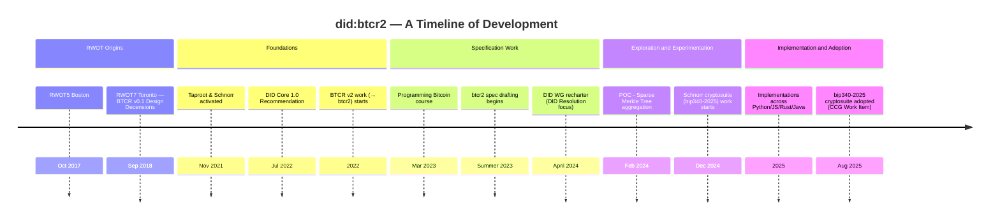

# did:btcr2 DID Method Specification

**did:btcr2** is a censorship resistant DID Method using the Bitcoin blockchain
as a Verifiable Data Registry to announce changes to the DID document.
It improves on prior work by allowing: zero-cost off-chain DID creation;
aggregated updates for scalable on-chain update costs; long-term identifiers
that can support frequent updates; private communication of the DID document;
private DID resolution; and non-repudiation appropriate for serious contracts.

The full specification may be viewed at https://dcdpr.github.io/did-btcr2/.

## Compiling the Specification Locally

On my mac:

```zsh
> cargo install mdbook mdbook-mermaid mdbook-bib mdbook-tera mdbook-pagetoc

> cd mdbook
> mdbook serve --open
```

The specification will be compiled and available in the `book/` folder and will
be served via http://localhost:3000.

# History and Evolution of the did:btcr2 DID method



## Jupyter Notebooks

Included under the `old-spec/notebooks` folder are a set of Jupyter notebooks that implement the
various features of the **did:btcr2** specification. These are included as helpful reference
material for those intending to implement the specification. To run the notebooks locally see
the `old-spec/notebooks/README.md`.
