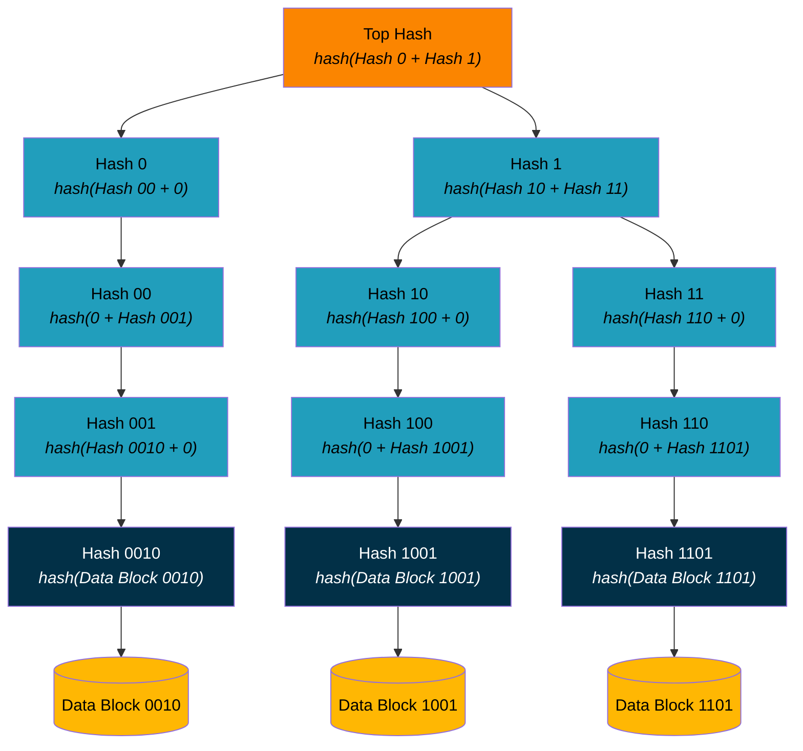
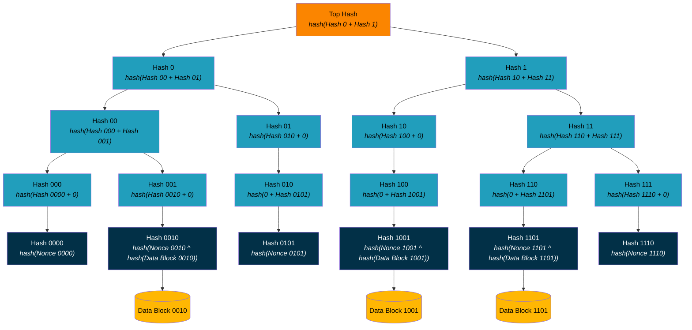
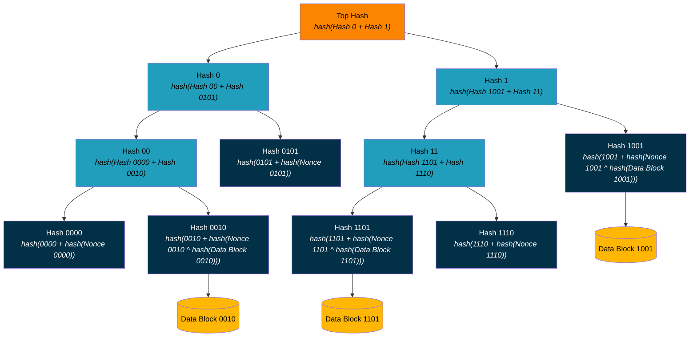

## Abstract

**did:btcr2** is a censorship-resistant Decentralized Identifier (DID) method using the Bitcoin blockchain as a Verifiable Data Registry to announce changes to the DID document. It supports zero-cost off-chain DID creation; aggregated updates for scalable on-chain update costs; long-term identifiers that can support frequent updates; private communication of the DID document; private DID resolution; and non-repudiation.

## Introduction and Motivation

Public digital identity was introduced to the Internet through Pretty Good Privacy's (PGP) foundational legal work in the 1990s. With Decentralized Identifiers (DIDs), digital identity can be preserved through a rotation of key material, without relying on a centralized party.

### Anti-censorship

Bitcoin is the world’s oldest and most reliable censorship-resistant network. Our primary motivation is to leverage the anti-censorship capability of Bitcoin to enable individuals to control decentralized identifiers without interference by centralized players. That means creating a W3C conformant DID method capable of creating identifiers usable for a range of verifiable interactions, including issuing Verifiable Credentials and proving that the current presenter is the subject of a Verifiable Credential. This DID method gives organizations and states the ability to anchor private attestations to identifiers under individuals’ direct control, giving humans an unprecedented ability to participate in digital interactions on their own terms, using the identifiers they choose, when they choose.

### Privacy

The first DID method anchoring on the Bitcoin blockchain, did:btcr, focused on censorship resistance. However, self-sovereign identity is not complete without options for privacy as well, and the initial promise of privacy in the DID ecosystem was dubious, with heavy reliance on public DID documents. There has been a presumption that anyone who has the DID itself should be able to resolve it to get the current DID document. This presumption places more information in the public eye than is strictly necessary for securing interactions related to the DID.

To tackle reliance on public DID documents head-on, this DID method introduces private DID documents, in which resolving the DID requires additional information delivered either alongside or in a separate communication from the DID controller. We call this transfer ::Sidecar:: delivery. Our approach ensures that successful resolution ALWAYS results in the same DID document for all parties, so that every party in the ecosystem sees the same cryptographically anchored result.

### Late Publishing

Many DID methods lack verifiable provenance. For many, it is simply impossible to reconstruct a cryptographically verifiable history of updates. Instead, they use a Verifiable Data Registry that can be used to rewrite history. Bitcoin's blockchain is the premiere global database for immutably anchoring information to a specific time. This DID method ensures that every BTCR2 DID is anchored on a single, canonical, immutable history for the lifetime of the DID. It is simply not possible for anyone to modify the history of the DID. We call this feature ::Non-Repudiation::.

### Offline Creation

Finally, we wanted to support the creation of DIDs without requiring on-chain interactions. BTCR creation depended on getting a transaction on-chain. BTCR2 supports creating DIDs with sophisticated DID documents without registering them on-chain. In fact, all BTCR2 DIDs start with offline creation. Only updates to the DID document require on-chain interactions. Our approach supports both key-based deterministic DIDs and document-based deterministic DIDs. In key-based DIDs, the DID itself contains everything you need to bootstrap an initial DID Document with usable verification methods suitable for authentication, attestation, and capability invocation and delegation. For document-based DIDs, additional ::Sidecar Data:: - a ::Genesis Document:: - must be used to create the ::Initial DID document::. Offline creation allows unlimited DID creation and use without requiring any on-chain or online interactions, making it suitable for a wide range of high-volume, low cost use cases.

## Conformance

As well as sections marked as non-normative, all authoring guidelines, diagrams, examples, and notes in this specification are non-normative. Everything else in this specification is normative.

The key words MAY, MUST, MUST NOT, RECOMMENDED, SHOULD, and SHOULD NOT in this document are to be interpreted as described in BCP 14 [RFC2119](https://www.ietf.org/rfc/rfc2119.txt) [RFC8174](https://datatracker.ietf.org/doc/html/rfc8174) when, and only when, they appear in all capitals, as shown here.

This document contains examples that contain JSON and JSON-LD content. Some of these examples contain characters that are invalid, such as inline comments (//) and the use of ellipsis (...) to denote information that adds little value to the example. Implementers are cautioned to remove this content if they desire to use the information as valid JSON or JSON-LD.

Interoperability of implementations of the **did:btcr2** DID method is tested by evaluating an implementation's ability to create, update, deactivate, and resolve **did:btcr2** identifier and DID documents that conform to this specification. Interoperability for producers and consumers of **did:btcr2** identifier and DID documents is provided by ensuring the DIDs and DID documents conform.

A conforming **did:btcr2** DID is any concrete expression of the rules specified in [Syntax] which complies with relevant normative statements in that section.

A conforming **did:btcr2** DID document is any concrete expression of the data model described in this specification which complies with the relevant normative statements in DID core sections [4\. Data Model](http://w3.org/TR/did-1.1/#data-model) and [5\. Core Properties](https://www.w3.org/TR/did-1.1/#core-properties). A serialization format for the conforming document is deterministic, bi-directional, and lossless, as described in [6\. Representations](https://www.w3.org/TR/did-1.1/#representations).

A conforming registrar is any algorithm realized as software and/or hardware that generates and updates conforming **did:btcr2** identifier or conforming DID Documents and complies with the relevant normative statements in [6\. Representations](https://www.w3.org/TR/did-1.1/#representations) of DID core and the [Create], [Update] and [Deactivate] sections of this specification.

A conforming **did:btcr2** resolver is any algorithm realized as software and/or hardware that complies with the relevant normative statements in [4\. DID Resolution](https://www.w3.org/TR/did-resolution/#resolving) of the DID Resolution specification and the [Resolve] section of this specification.

## Terminology

Aggregate Beacon

: An Aggregate Beacon enables multiple entities (possibly controlling multiple DIDs and possibly posting multiple updates) to collectively announce a set of ::BTCR2 Updates:: in a ::Beacon Signal::.

There can only ever be one ::BTCR2 Update:: per **did:btcr2** in a ::Beacon Signal:: from an Aggregate Beacon.

Aggregate Beacons

: ::Aggregate Beacon::

Authorized Beacon Signal

: An Authorized Beacon Signal is a ::Beacon Signal:: from a ::BTCR2 Beacon:: with a ::BTCR2 Beacon:: address in a then-current DID document.

Authorized Beacon Signals

: ::Authorized Beacon Signal::

Beacon Address

: The Bitcoin address of a ::BTCR2 Beacon::. Spends of ::UTXO:: controlled by this address are identified as ::Beacon Signals::.

Beacon Addresses

: ::Beacon Address::

Beacon Aggregator

: The entity that coordinates the protocols of an aggregate ::BTCR2 Beacon::. Specifically the Create Beacon Cohort and Announce Beacon Signal protocols.

Beacon Aggregators

: ::Beacon Aggregator::

Beacon Announcement Map

: A document that maps **did:btcr2** identifiers to ::BTCR2 Update Announcements::. This is used to distinguish which ::BTCR2 Update Announcement:: applies to which **did:btcr2** identifier.

Beacon Announcement Maps

: ::Beacon Announcement Map::

Beacon Cohort

: The set of unique cryptographic keys participating in a ::BTCR2 Beacon:: that are required to authorize spends from the ::Beacon Address::.

Beacon Cohorts

: ::Beacon Cohort::

Beacon Participant

: A member of a ::Beacon Cohort::, typically a DID controller, that controls cryptographic keys required to partially authorize spends from a ::Beacon Address::.

Beacon Participants

: ::Beacon Participant::

Beacon Signal

: Beacon Signals are Bitcoin transactions that spend from a ::BTCR2 Beacon:: address and include a transaction output of the format `[OP_RETURN, OP_PUSH_BYTES, <32_bytes>]`. Beacon Signals announce one or more ::BTCR2 Updates:: and provide a means for these updates to be validated against the Beacon Signal.

The type of the ::BTCR2 Beacon:: determines how these Beacon Signals are constructed and processed to validate a set of ::BTCR2 Updates:: against the 32 bytes contained within the Beacon Signal.

Beacon Signals

: ::Beacon Signal::

Beacon Type

: The type of a ::BTCR2 Beacon::. The Beacon Type defines how ::BTCR2 Update Announcements:: are included within a ::Beacon Signal:: broadcast on the Bitcoin network. It also defines how the content committed within ::BTCR2 Update Announcements:: can be validated against the ::Beacon Signal::.

Beacon Types

: ::Beacon Type::

BTCR2 Beacon

: A abstract mechanism, identified by a ::Beacon Address::, that is included as a service in a DID document to indicate to resolvers that spends from this address, called ::Beacon Signals::, should be discovered and checked for ::BTCR2 Update Announcements::.

BTCR2 Beacons

: ::BTCR2 Beacon::

: ::BTCR2 Beacon::

BTCR2 Update

: A capability invocation secured using Data Integrity that invokes an authorization capability to update a specific **did:btcr2** DID document. This capability invocation Data Integrity proof secures the ::Unsecured BTCR2 Update:: document.

BTCR2 Updates

: ::BTCR2 Update::

BTCR2 Update Announcement

: A 32 byte SHA256 hash committing to a ::BTCR2 Update:: that has been broadcast by a ::BTCR2 Beacon:: in an ::Authorized Beacon Signal::. ::Beacon Signals:: can include one or more BTCR2 Update Announcements. How ::Beacon Signals:: include announcements is defined by the ::Beacon Type::.

BTCR2 Update Announcements

: ::BTCR2 Update Announcement::

Contemporary DID Document

: The DID document that is contemporary with a Bitcoin block at a specific blockheight.
The Contemporary DID Document changes as a resolver traverses the blockchain and applies 
the relevant ::BTCR2 Updates:: announced by ::Authorized Beacon Signals:: it identifies in 
specific Bitcoin blocks.

Content Addressable Storage

: Content Addressable Storage (CAS) is a data storage system where content is addressable using ::Content Identifiers:: (CIDs). The InterPlanetary File System (IPFS) is an example of CAS.

CAS

: ::Content Addressable Storage::

Content Identifier

: A Content Identifier (CID) is an identifier for some digital content (e.g., a file) generated from the content itself such that for any given content and CID generation algorithm there is a single, unique, collision-resistant identifier. This is typically done through some hashing function.

Content Identifiers

: ::Content Identifier::

CID

: ::Content Identifier::

CIDs

: ::Content Identifier::

Genesis Bytes

: The bytes used to generate a did:btcr2 identifier. These bytes are either a
  33-byte compressed SEC encoded sec256k1 public key or a 32 byte SHA256 hash of
  a ::Genesis Document::.

Genesis Document

: An intermediate representation of an ::Initial DID Document:: with the
  identifier set to the placeholder value.

Initial DID Document

: The canonical, conformant version 1 of a DID document for a specific **did:btcr2** identifier.

Initial DID Documents

: ::Initial DID Document::


Late Publishing

: Late Publishing is the ability for DID updates to be revealed at a later point in time, which alters the history of a DID document such that a state, that appeared valid before the reveal, appears after Late Publishing to never have been valid. Late Publishing breaks ::Non-Repudiation::.

Map Beacon

: A type of ::BTCR2 Beacon:: which aggregates multiple ::BTCR2 Update Announcements::. A ::Beacon Signal:: from a Map Beacon commits to a ::Beacon Announcement Map::.

Map Beacons

: ::Map Beacon::

Merkle Tree

: A tree data structure in which the leaves are a hash of a data block and every node that is not a leaf is a hash of its child node values.

The root of a Merkle Tree is a single hash that is produced by recursively hashing the child nodes down to the leaves of the tree. Given the root of a Merkle Tree it is possible to provide a Merkle path that proves the inclusion of some data in the tree.

Merkle Trees

: ::Merkle Tree::

Non-Repudiation

: Non-Repudiation is a feature of DID methods that can clearly state that all data is available to present one canonical history for a DID.

If some data is needed but not available, the DID method MUST NOT allow DID resolution to complete. Any changes to the history, such as may occur if a website edits a file, MUST be detected and disallowed. The ::Late Publishing:: problem breaks Non-Repudiation.

Offline Creation

: Offline Creation refers to when a **did:btcr2** identifier and corresponding initial DID document are created without requiring network interactions.

**did:btcr2** supports offline creation in two modes:

* Key Pair Deterministic Creation; and  
* DID Document Initiated Creation.

Resolution Time

: A Coordinated Universal Time (UTC) timestamp of when the client makes a resolution request of the controller.

Schnorr Signature

: An alternative to Elliptic Curve Digital Signature Algorithm (ECDSA) signatures with some major advantages, such as being able to combine digital signatures from multiple parties to form a single digital signature for the composite public key.

Bitcoin Schnorr signatures are still over the secp256k1 curve, so the same keypairs can be used to produce both Schnorr signatures and ECDSA signatures.

Schnorr Signatures

: ::Schnorr Signature::

Schnorr

: ::Schnorr Signature::

Sidecar

: A mechanism by which data necessary for resolving a DID is provided alongside the **did:btcr2** identifier being resolved, rather than being retrieved through open and standardized means (e.g., by retrieving from IPFS).

: To explain the metaphor, a sidecar on a motorcycle brings along a second passenger in a transformed vehicle, the same way the DID controller MUST bring along the DID document history to transform the situation into one that is verifiable.

Sidecar Data

: Data transmitted via ::Sidecar::.

Signal Bytes

: The 32 bytes of information that are included within the last transaction output of a ::Beacon Signal::. 
The script of this transaction output has the following form: `[OP_RETURN, OP_PUSH_BYTES, <32 signal bytes>]`.

Singleton Beacon

: A type of ::BTCR2 Beacon:: whose ::Beacon Signals:: each contain a single ::BTCR2 Update Announcement::.

Singleton Beacons

: ::Singleton Beacon::

SMT Beacon

: A type of ::BTCR2 Beacon:: which aggregates multiple ::BTCR2 Update Announcements::.  
A ::Beacon Signal:: from an SMT Beacon contains the root of an optimized ::Sparse Merkle Tree::.

SMT Beacons

: ::SMT Beacon::

Sparse Merkle Tree

: A ::Merkle Tree:: data structure where each data point included at the leaf of the tree is indexed.

This data structure enables proofs of both inclusion and non-inclusion of data at a given index. The instantiation in this specification has 2^256 leaves that are indexed by the SHA256 hash of a **did:btcr2** identifier. The data attested to at the leaves of the tree is the ::BTCR2 Update:: for that **did:btcr2** identifier that indexed to the leaf.

SMT

: ::Sparse Merkle Tree::

Sparse Merkle Trees

: ::Sparse Merkle Tree::

SMT Proof

: A set of SHA256 hashes for nodes in a ::Sparse Merkle Tree:: that together form a path from a leaf in the tree
to the Merkle root, proving that the leaf is in the tree.

Unsecured BTCR2 Update

: A ::BTCR2 Update:: without a proof attached to it invoking the capability to apply the update to a **did:btcr2** DID document. An Usecured BTCR2 Update contains the JSON Patch object that defines the set of mutations to be applied to a DID document, along with the new version of the DID document and the source and target hashes of the DID document identifying the source DID document that the patch should be applied to and the target DID document that results from appliying the patch.

Unsecured BTCR2 Updates

: ::Unsecured BTCR2 Update::

Unsigned Beacon Signal

: The Bitcoin transaction of the ::Beacon Signal:: before its transaction inputs have been signed, effectively spending these inputs.

Unspent Transaction Output

: A Bitcoin transaction takes in transaction outputs as inputs and creates new transaction outputs potentially controlled by different addresses. An Unspent Transaction Output (UTXO) is a transaction output from a Bitcoin transaction that has not yet been included as an input, and hence spent, within another Bitcoin transaction.

UTXO

: ::Unspent Transaction Output::

Unspent Transaction Outputs

: ::Unspent Transaction Output::

UTXOs

: ::Unspent Transaction Output::

## Syntax

A **did:btcr2** Decentralized Identifier (DID) consists of a `did:btcr2` prefix, followed by an `id-bech32` value, which is a [Bech32m](https://github.com/bitcoin/bips/blob/master/bip-0350.mediawiki) encoding of the following data:

* `version` \- the specification version the DID was created against;  
* `network` \- the Bitcoin network the DID can be used on; and  
* either:  
  * a `key-value` representing a secp256k1 public key; or  
  * a `hash-value` representing the hash of an initiating external DID document.

The specification `version` and the Bitcoin `network` are encoded into a single byte as follows:

1. The first four bits (high nibble) are the `version` minus one. For this version of the specification, the `version` is `1` and the high nibble is `0`.  
2. The second (remaining) four bits (low nibble) are the Bitcoin `network` identifier, one of:  
   1. `0` \= bitcoin (mainnet);  
   2. `1` \= signet;  
   3. `2` \= regtest;  
   4. `3` \= testnet v3;  
   5. `4` \= testnet v4;  
   6. `5` \= mutinynet;  
   7. `6`\-`B` \= reserved for future use by the specification; or  
   8. `C`\-`F` \= user-defined index into a custom test network.

The user-defined index allows any user to stand up a custom test network and create **did:btcr2** identifiers on it. However, anyone encountering such an identifier would have to know the details of the network (e.g., challenge and seed node for signet) to use it. This means that:

* The interpretation of a user-defined index is by mutual agreement between parties issuing **did:btcr2** identifiers and those resolving them.  
* Other users may use the same index, and **did:btcr2** identifiers will **not** be interoperable in each other's network.

When the last part of the encoding is of a `key-value`, the Human Readable Part (HRP) of the Bech32 encoding is set to `k`. When the last part of the encoding is of a `hash-value`, the HRP is set to `x`. The HRP is followed by a separator which is always `1`, which is then followed by the `bech32-encoding`.

The Augmented Backus-Naur (ABNF) for a **did:btcr2** identifier is as follows:

```
did-btcr2 = "did:btcr2:" id-bech32
id-bech32 = key-encoding / hash-encoding
hash-encoding = "x1" bech32-encoding
key-encoding = "k1" bech32-encoding
bech32-encoding = *bech32char
bech32char = "0" / "2" / "3" / "4" / "5" / "6" / "7" / "8" / "9" / "a" / "c" / 
"d" / "e" / "f" / "g" / "h" / "j" / "k" / "l" / "m" / "n" / "p" / "q" / "r" / 
"s" / "t" / "u" / "v" / "w" / "x" / "y" / "z" 
```

ABNF is defined by [Internet Engineering Task Force (IETF) RFC5234](https://datatracker.ietf.org/doc/html/rfc5234).

For details on how to interpret a BTCR2 DID, see [Resolve].

## Update Distribution

When additional data is required for resolution, the controller has two primary means for getting that data to the Resolver, both secured by cryptographic hash. The first is using ::Sidecar::. The second is ::Content Addressable Storage:: (CAS). No matter, how the Resolver gets this data, all update data must be available to process resolution. We use cryptographic hashes to ensure that the data received by the Resolver is the data secured by a legitimate update.

All JSON documents used for resolution are identified by their SHA256 cryptographic hash by first canonicalizing the document according to the [JSON Canonicalization and Algorithm](https://www.rfc-editor.org/rfc/rfc8785) and the computing the SHA256 hash of the canonicalized document.

As a resolver goes through the resolution process, it encounters one or more document hashes, which it uses to identify the files of interest.

While it's possible for a single **did:btcr2** identifier to mix the two distribution mechanisms, it is not recommended. Instead, it is RECOMMENDED that controllers pick a distribution mechanism and use it throughout the lifetime of a given DID.

### Sidecar

::Sidecar:: provides  alongside the **did:btcr2** identifier being resolved. This is analogous to a sidecar on a motorcycle bringing along a second passenger: the DID controller provides the DID document history (in the form of ::BTCR2 Updates:: and any additional proofs) alongside the DID to the relying party so that the resolver can construct the DID document.

In short, when a resolver is presented with a **did:btcr2** identifier, it is also presented with files matching the SHA256 hashes it encounters during the resolution process. If any SHA256 hash doesn't have a corresponding file, the resolution fails.

### Content Addressable Storage (CAS)

Content Addressable Storage (CAS) is a mechanism by which a file stored is addressed by its content, not its name or location. The content address is determined by a cryptographic hash of the file. The hash is then passed into a retrieval function specific to the type of ::CAS:: to retrieve the file.

Any ::CAS:: that provides a deterministic mapping from a SHA256 hash of a file may be used, and a resolver SHOULD be informed of the specific ::CAS:: mechanism so that it can retrieve documents associated with a **did:btcr2** identifier efficiently. If the ::CAS:: mechanism is not provided, the resolver MAY iterate through all supported ::CAS:: mechanisms to find the files or it MAY return with an error indicating that the ::CAS:: mechanism is required.

At this time, IPFS is the only known ::CAS:: to provide a deterministic mapping from a SHA256 hash.

#### Interplanetary File System (IPFS)

The Interplanetary File System ([IPFS](https://docs.ipfs.tech/)) “is a set of open protocols for addressing, routing, and transferring data on the web, built on the ideas of content addressing and peer-to-peer networking.”

A detailed description is available at the [IPFS documentation site](https://docs.ipfs.tech/), but for the purposes of **did:btcr2**, it is a distributed file system where the files are identified using a unique ::Content Identifier:: (CID) based on the content of the file. The content of the file determines the ::CID::, and the ::CID:: may be used by anyone, anywhere, to retrieve the file.

For did:btcr2 identifiers, files stored in IPFS MUST override the default chunking behaviour by storing the file as a raw binary using the [Raw Leaves option](https://richardschneider.github.io/net-ipfs-engine/articles/fs/raw.html). This limits the file size to the block size (default 256 kB, maximum 1 MB), but that should be sufficient for most applications and ensures that the entire file is included when calculating the CID.

The IPFS CIDv1 is a binary identifier constructed from the file hash as:

* 0x01, the code for CIDv1;  
* 0x00, the [multicodec](https://github.com/multiformats/multicodec) code for raw binary;  
* 0x12, the [multihash](https://github.com/multiformats/multihash) code for SHA-256; and  
* the SHA-256 of the file.

The stringified version of the CIDv1 is accomplished using [multibase](https://github.com/multiformats/multibase) encoding. The final URL is “ipfs://\<stringified CIDv1\>”.

A resolver retrieves a file associated with a SHA256 hash by constructing the IPFS CIDv1 per the above algorithm and requesting the file from an IPFS node.

## Dereferencing

To dereference a BTCR2 DID URL, first resolve the DID in the DID URL to get the appropriate DID document. Then use that DID document to interpret the path, query, and fragment parts of the URL according to the [DID URL Dereferencing](https://w3c.github.io/did-resolution/#dereferencing) section of the [DID Resolution](https://w3c.github.io/did-resolution) specification.

Dereferencing a DID URL that has no path, query, or fragment parts MUST return the DID document from resolution.

BTCR2 provides no DID-method-specific dereferencing mechanisms. However, we anticipate a potential future option to enable a BTCR2 DID URL that dereferences Ordinal-based assets that are stored on-chain. However, this is out of scope for this specification.

## Beacons

### Overview

A ::BTCR2 Beacon:: is a service listed in a BTCR2 DID document that informs resolvers how to find authentic updates to the DID. The service properties define a Bitcoin address to watch for ::Beacon Signals::.

All Beacon Signals broadcast from a ::BTCR2 Beacon:: in the ::Contemporary DID Document:: MUST be processed as part of DID document resolution. The ::Beacon Type:: in the service defines how ::Beacon Signals:: MUST be processed.

Any on-chain Beacon Signal that cannot be processed renders the related DID invalid. For this reason, all DID controllers SHOULD ensure the ::Beacon Addresses:: they include in their DID document require their cryptographic approval so spend ::UTXO:: controlled by the address, so that only approved Signals can be posted to Bitcoin. For resilience, BTCR2 DIDs can specify any number of Beacons and SHOULD include at least one ::Singleton Beacon:: as a fallback in case all ::Aggregate Beacons:: fail.

A ::Beacon Signal:: commits to, and anchors in a Bitcoin block 32 bytes of information. These ::Signal Bytes:: represent one of the following:

* a ::BTCR2 Update Announcement::;  
* the hash of a ::Beacon Announcement Map::; or  
* the 32 bytes of an optimized ::Sparse Merkle Tree:: root, where each leaf node is deterministically selected by a **did:btcr2** identifier and contains a hash associated with the **did:btcr2** identifier.

**did:btcr2** supports different ::Beacon Types::, with each type defining a set of algorithms for:

1. How a ::BTCR2 Beacon:: can be established and added as a service to a DID document.  
2. How ::BTCR2 Update Announcements:: are broadcast within ::Beacon Signals::.  
3. How a resolver processes ::Beacon Signals::, identifying, verifying, and applying the authorized mutations to a DID document for a specific DID.

This is an extensible mechanism, such that in the future new ::Beacon Types:: could be added.

The current, active ::BTCR2 Beacons:: of a DID document are specified in the document's `service` property. By updating the DID document, a DID controller can change the set of ::BTCR2 Beacons:: they use to broadcast updates to their DID document over time. Resolution of a DID MUST process signals from all ::BTCR2 Beacons:: identified in the latest DID document and apply them in the order determined by the version specified by the `btcr2Update`.

All resolvers of **did:btcr2** DIDs MUST support the ::Beacon Types:: defined in this specification.

## Aggregation

Three types of ::BTCR2 Beacons:: are defined: SingletonBeacon, MapBeacon and SMTBeacon.  Two of them, MapBeacon and SMTBeacon, support aggregation, i.e. the act of  committing to multiple ::BTCR2 Update Announcements:: in a ::Beacon Signal::.

### Aggregation Participants

The participants in aggregation are as follows:

* DID controller \- A party that controls one or more **did:btcr2** identifiers participating in a ::BTCR2 Beacon::.  
* ::Beacon Cohort:: \- The set of unique cryptographic keys participating in a ::BTCR2 Beacon:: that make up its n-of-n MuSig2 Bitcoin address.  
* ::Beacon Aggregator:: \- The entity that coordinates the protocols of an Aggregate ::BTCR2 Beacon::, specifically the "Create Beacon Cohort" and "Announce Beacon Signal" protocols.  
* ::Beacon Participant:: \- A member of a ::Beacon Cohort::, typically a DID controller, that controls cryptographic keys required to partially authorize the broadcasting of a ::Beacon Signal:: to the Bitcoin blockchain.  
* Verifier \- A party verifying a **did:btcr2** identifier presentation.

How coordination between an aggregator and multiple ::Beacon Participants:: is managed is out of scope, but one possible mechanism is outlined in “MuSig2 3-of-3 Multisig with Coordinator Facilitation” at [MuSig2 Sequence Diagrams](https://developer.blockchaincommons.com/musig/sequence/#musig2-3-of-3-multisig-with-coordinator-facilitation).

When defining a ::Beacon Cohort::, the ::Beacon Aggregator:: may define the conditions for the cohort, including but not limited to:

* Automatic publication to ::CAS:: (::Map Beacon:: only).  
* Minimum and/or maximum number of ::Beacon Participants::.  
* Minimum and/or maximum number of DIDs per ::Beacon Participant::.  
* Cost of enrollment.  
* Cost per signal per DID or ::Beacon Participant::.  
* Minimum and/or maximum time between signals.  
* Number of pending updates that trigger a signal.

#### Singleton Beacon

A ::Singleton Beacon:: is a ::BTCR2 Beacon:: that can be used to announce commitments to a single ::BTCR2 Update:: targeting a single DID document. It creates a ::Beacon Signal:: that commits to a single ::BTCR2 Update Announcement::. This is typically done directly by the DID controller, as there is no ::Beacon Cohort::.

If the ::BTCR2 Update:: committed to by the ::BTCR2 Update Announcement:: is not publicly discoverable (i.e., is not published to a ::CAS:: under its hash), the only parties that are aware of it are the DID controller and any parties provided it by the DID controller.

The type of a service defining a ::Singleton Beacon:: in a DID document is "SingletonBeacon".

### Map Beacon

A ::Map Beacon:: creates a ::Beacon Signal:: that commits to multiple ::BTCR2 Update Announcements:: through a ::Beacon Announcement Map::. To do so, it constructs a map where the key is the **did:btcr2** identifier and the value is the hash of the corresponding ::BTCR2 Update::, and broadcasts a SHA256 hash of the map in the ::Beacon Signal::.

If a ::BTCR2 Update:: is not publicly discoverable (i.e., is not published to a ::CAS:: under its hash), the only parties that are aware of it are the DID controller and any parties provided it by the DID controller. However, any party that has access to or is provided the map is at least aware of the existence of all **did:btcr2** identifiers in the map and the existence of their ::BTCR2 Update Announcements::.

For a ::Map Beacon::, proof of non-inclusion of a **did:btcr2** identifier is simply its absence from the map.

The type of a service defining a ::Map Beacon:: in a DID document is "MapBeacon".

### SMT Beacon

An ::SMT Beacon:: creates a ::Beacon Signal:: that commits to multiple ::BTCR2 Update Announcements::, each identified by a **did:btcr2** identifier. To do so, it constructs an optimized ::Sparse Merkle Tree:: as defined in [Appendix SMT - Optimized Sparse Merkle Tree Implementation] and publishes the Merkle root.

An ::SMT Beacon:: provides maximum privacy for the DID controller, as the DID controller never has to reveal their DIDs or ::BTCR2 Updates:: to the aggregator. This introduces a small risk, as the DID controller is not required to prove control over a DID in order to participate.

The type of a service defining a ::SMT Beacon:: in a DID document is "SMTBeacon".

## CRUD Operations

This section defines the Create, Read, Update, and Deactivate (CRUD) operations
for the **did:btcr2** method.

### Create

Creating a **did:btcr2** identifier is entirely offline, requiring no innate
network interactions or onchain anchoring transactions to generate a new identifier.
Each creation starts either with a public key or a ::Genesis Document::.  
Both creation algorithms first create the ::Genesis Bytes:: that commit
to an ::Initial DID Document::.

To create a **did:btcr2** identifier from a public key without an Initial DID
Document, use [Algo 1: Create Genesis Bytes from Public Key], then encode those
bytes along with a version, network for the identifier and an identifier type of
"key" as in [Algo 3: Encode Identifier].

To create a **did:btcr2** identifier from a ::Genesis Document::, use
[Algo 2: Create Genesis Bytes from Genesis Document], then encode those
bytes along with a version, network for the identifier and an identifier type of
"external" using [Algo 3: Encode Identifier].

The output of encoding the identifier is the newly created DID.

Note: When creating from a ::Genesis Document::, it is likely that creators
will want to include information, such as ::BTCR2 Beacons:: and other service
endpoints. While services such as ::BTCR2 Beacons:: may require network interactions,
e.g., to establish a unique ::Beacon Address:: for updates, they do not
require onchain anchoring.

#### Algo 1: Create Genesis Bytes from Public Key {.tabbed .unnumbered}

The ::Genesis Bytes:: is a 33-byte compressed representation of a
[secp256k1 public key](https://www.secg.org/sec2-v2.pdf) following the encoding
defined in the [Standards for Efficient Cryptography](https://www.secg.org/sec1-v2.pdf)
(SEC encoding).

##### Hide {.unnumbered .unlisted}

##### Examples {.unnumbered .unlisted}

[**Example 1.1** - The Genesis Bytes of a SEC encoded secp256k1 public key]{.example-caption}

`b"\x03\x193\xf6\xbe\xb1\xbf\x10[\xd0\xaf\x9c\x18wE\xf3\x82\x89d\x03\xe1\x16\xe4\xd1\xf3\x05'\x93k\xe5\x96\xe0\x01"`

#### Algo 2: Create Genesis Bytes from Genesis Document {.tabbed .unnumbered}

The ::Genesis Bytes:: is a 32-byte [SHA256](https://datatracker.ietf.org/doc/html/rfc6234)
hash of an input ::Genesis Document:: canonicalized using the
[JSON Canonicalization Scheme](https://www.rfc-editor.org/rfc/rfc8785). The
::Genesis Document:: is an intermediate representation of an
::Initial DID Document:: with the identifier values replaced with a placeholder
value. The placeholder value MUST be
did:btcr2:xxxxxxxxxxxxxxxxxxxxxxxxxxxxxxxxxxxxxxxxxxxxxxxxxxxxxxxxxxxx. This is
"did:btcr2:" followed by 60 'x's, one for each character in the method-specific
identifier.

In order for this DID to be updatable, controllers must include at least one
verification method with a [capability invocation](https://www.w3.org/TR/cid-1.0/#capability-invocation) verification relationship and
at least one ::BTCR2 Beacon:: service.

Controllers may also add content to the ::Genesis Document::, including keys and
services.

It is RECOMMENDED that controllers add at least one ::Singleton Beacon:: to
provide a fallback update capability. This ensures the controller can update the
DID without reliance on any ::Beacon Aggregators:: or other parties.

##### Hide {.unnumbered .unlisted}

##### Imperative Algorithm {.unnumbered .unlisted}

Inputs:

* `genesisDocument` - any intermediate representation of an initial DID document
  with the identifier replaced with the placeholder value throughout all fields
  (e.g., the id field) with
  `did:btcr2:xxxxxxxxxxxxxxxxxxxxxxxxxxxxxxxxxxxxxxxxxxxxxxxxxxxxxxxxxxxx`.
  REQUIRED; object.

Outputs:

* `genesisBytes` - a newly created **did:btcr2** identifier;
  string

The steps are as follows:

1. Set `canonicalizedDocument` to the result of passing `genesisDocument` into
   the JSON Canonicalization Scheme.
2. Set `genesisBytes` to the SHA256 hash of the `canonicalizedDocument`.
3. Return `genesisBytes`.

##### Examples {.unnumbered .unlisted}

[**Example 2.1** - A Genesis Document]{.example-caption}

```{.json include="json/CRUD-Operations/genesis-document.json"}
```

[**Example 2.2** - The Genesis Bytes for the above Genesis Document]{.example-caption}

`b'\xe4\xedJwv\t\xca;\xbc\xa9\x9f\x80\xb9\x82\xf5q\x14\x1dX\x8f;\x9b\x80=O\xbe$\xa3st\x1b\xe8'`

#### Algo 3: Encode Identifier {.tabbed .unnumbered}

The identifier uses a [bech32m](https://en.bitcoin.it/wiki/BIP_0350#Bech32m)
encoding of input bytes composed of the version, network and ::Genesis Bytes::.
The value of the version MUST be 1. The value of the network declares which
Bitcoin network anchors the identifier and MUST be selected from the table below.

The input bytes to the bech32m algorithm are constructed as follows: the first
byte is the version and the network, with the version minus one in the low
nibble and the value from the network table in the high nibble. The Genesis
Bytes are then appended to the first byte to produce the input bytes. Encode the
input bytes using the bech32m algorithm with the human-readable part (hrp) value
set to the ASCII value of either 'k' or 'x', depending on the type of the
identifier. For **did:btcr2** identifiers generated from an initial secp256k1
public key, use 'k' for *did:btcr2* identifiers generated from an Initial DID
Document, use 'x'. The result of the encoding is the method-specific identifier.
Prepend the method-specific identifier with the ASCII string "did:btcr2:" to
create the DID.

NOTE: In future versions of this algorithm, it is expected that the version
could take up more than one nibble with the nibble set to F indicating that the
next nibble should be considered a part of the version.

| Network          | Value |
|:-----------------|:------|
| bitcoin          | 0     |
| signet           | 1     |
| regtest          | 2     |
| testnet3         | 3     |
| testnet4         | 4     |
| mutinynet        | 5     |
| reserved         | 6-B   |
| custom network 1 | C     |
| custom network 2 | D     |
| custom network 3 | E     |
| custom network 4 | F     |

Note: The values 6 through B are reserved by the specification for future use, such as identifying
new Bitcoin test networks as they become adopted.

##### Hide {.unnumbered .unlisted}

##### Imperative Algorithm {.unnumbered .unlisted}

Inputs:

* `idType` - required, one of:
  * "key"
  * "external"
* `version` - required, number
* `network` - required, one of:
  * "bitcoin"
  * "signet"
  * "regtest"
  * "testnet3"
  * "testnet4"
  * "mutinynet"
  * "custom network 1"
  * "custom network 2"
  * "custom network 3"
  * "custom network 4"
* `genesisBytes` - required, byte array, one of:
  * a compressed secp256k1 public key if `idType` is "key"
  * a hash of an initiating external DID document if `idType` is "external"

Output:

* identifier - a **did:btcr2** identifier

Encode the **did:btcr2** identifier as follows:

1. If `idType` is not a valid value per above, raise `invalidDid` error.
2. If `version` is greater than `1`, raise `invalidDid` error.
3. If `network` is not a valid value per above, raise `invalidDid` error.
4. If `idType` is "key" and `genesisBytes` is not a valid compressed secp256k1
   public key, raise `invalidDid` error.
5. Map `idType` to `hrp` from the following:
    1. "key" - "k"
    2. "external" - "x"
6. Create an empty `nibbles` numeric array.
7. Set `fCount` equal to `(version - 1) / 15`, rounded down.
8. Append hexadecimal `F` (decimal `15`) to `nibbles` `fCount` times.
9. Append `(version - 1) mod 15` to `nibbles`.
10. If `network` is a string, append the numeric value from the following map to
    `nibbles`:
    1. "bitcoin" - `0`
    2. "signet" - `1`
    3. "regtest" - `2`
    4. "testnet3" - `3`
    5. "testnet4" - `4`
    6. "mutinynet" - `5`
    7. "custom number 1" - C
    8. "custom number 2" - D
    9. "custom number 3" - E
    10. "custom number 4" - F
11. If the number of entries in `nibbles` is odd, append `0`.
12. Create a `dataBytes` byte array from `nibbles`, where `index` is from `0` to
    `nibbles.length / 2 - 1` and
    `encodingBytes[index] = (nibbles[2 * index] << 4) | nibbles[2 * index + 1]`.
13. Append `genesisBytes` to `dataBytes`.
14. Set `identifier` to "did:btcr2:".
15. Pass `hrp` and `dataBytes` to the
    [bech32m](https://en.bitcoin.it/wiki/BIP_0350#Bech32m) encoding algorithm,
    retrieving `encodedString`.
16. Append `encodedString` to `identifier`.
17. Return `identifier`.

##### Examples {.unnumbered .unlisted}

[**Example 3.1** - A did:btc2 identifier derived from a secp256k1 public key that anchors updates to the Bitcoin mainnet]{.example-caption}

`did:btcr2:k1qqp3jvlkh6cm7yzm6zhecxrhghec9ztyq0s3dex37vzj0ymtuktwqqg4vlfh3`

[**Example 3.2** - A did:btc2 identifier derived from a Genesis Document that anchors updates to the Bitcoin mutinynet]{.example-caption}

`did:btcr2:x1qhjw6jnhwcyu5wau4x0cpwvz74c3g82c3uaehqpaf7lzfgmnwsd7spmmf54`

### Resolve

Resolving a **did:btcr2** identifier takes an input DID and returns the
canonical DID document at the requested target time as well as additional
metadata in a [DID Resolution Result](https://w3c.github.io/did-resolution/#did-resolution-result).
The current time is the default target time for a resolution request.

Resolution takes part in two steps.

First, establish the ::Initial DID Document::. Start processing the resolution
inputs, parsing the identifier and any resolution options using [Algo 4. Process
Resolution Inputs]. Then establish the ::Initial DID Document:: according to the
type of the identifier. If the identifier encodes a 33-byte compressed secp256k1
public key, the ::Initial DID Document:: can be generated by following [Algo 5.
Deterministically Generate Initial DID Document]. Otherwise, the identifier MUST
encode a 32-byte hash of a ::Genesis Document::, in this case first retrieve the
::Genesis Document:: using [Algo 6. Retrieve Genesis Document] and then verify
this document according to [Algo 7. Verify Genesis Document].

Second, iterate through ::Beacon Signals:: posted to the Bitcoin blockchain
using [Algo 8. Process Beacon Signals] processing them according to their
::Beacon Type::. Processing ::Beacon Signals:: retrieves the announced ::BTCR2
Update:: for the DID being resolved. The algorithms for processing ::Beacon
Signals:: according to their ::Beacon Types:: are as follows: for ::Singleton
Beacons:: use [Algo 9. Process Singleton Beacon Signal];  for ::Map Beacons::
use [Algo 10. Process Map Beacon Signal]; for ::SMT Beacons:: use [Algo 11.
Process SMT Beacon Signal].

::BTCR2 Updates:: announced with ::Beacon Signals:: are then applied to the DID
document. ::BTCR2 Updates:: MUST be invocations of the capability to update the
DID being resolved. To verify this, the resolver MUST first derive the root
capability from the DID itself using  [Algo 12. Derive Root Capability], then
verify and apply the invocation using [Algo 13. Apply BTCR2 Update].

Traverse the blockchain and apply updates in temporal order, updating and
maintaining a ::Contemporary DID Document:: until all updates are processed.
At each stage, the Contemporary DID Document defines the ::BTCR2 Beacons::
active at that point in time; those Beacons – and only those Beacons – are checked
for updates.

Continue traversing the chain until all timely, authentic ::Beacon Signals::
have been processed and their announced updates have been applied in order.

The resulting DID document is the canonical DID Document and MUST be returned to
the caller of the resolver function in a resolution response which can be
constructed following [Algo 14. Construct Resolution Result].

NOTE. If there are no updates, the ::Initial DID Document:: is returned unless a specific versionId has been targetted by the resolution request.

#### Algo 4. Process Resolution Inputs {.tabbed .unnumbered}

This algorithm processes the resolution inputs from a resolution request. First,
parse the identifier string, then process the resolution options.

First take the identifier string, validate it according to the [DID syntax](https://www.w3.org/TR/did-1.1/#did-syntax)
and decode it to retrieve the identifier type, version, network and ::Genesis
Bytes::.

The identifier string MUST consist of three components separated by a ‘:’
character. The first component MUST be the string ‘did’, the second component
MUST be ‘btcr2’ and the third component is the BTCR2-specific identifier.
Otherwise an INVALID_DID error MUST be raised.

The BTCR2-specific identifier is decoded using the [bech32m](https://en.bitcoin.it/wiki/BIP_0350#Bech32m) algorithm which
returns the human readable part (*hrp value*) and the encoded data bytes. The
encoded data bytes MUST be parsed as follows to retrieve the version, network,
and ::Genesis Bytes::. The low nibble of the first byte indicates the version;
the high nibble of the first byte indicates the specific Bitcoin network used
to anchor the identifier, and all bytes after the first byte are the ::Genesis
Bytes::.

To get the version, add one to the value in the low nibble of the first byte.
At this time, the version MUST be 1. Any other value results in an INVALID_DID
error.

To get the network, look up the value from the high nibble of the first byte in
this table.

| Value | Network          |
|:------|:-----------------|
| 0     | bitcoin          |
| 1     | signet           |
| 2     | regtest          |
| 3     | testnet3         |
| 4     | testnet4         |
| 5     | mutinynet        |
| C     | custom network 1 |
| D     | custom network 2 |
| E     | custom network 3 |
| F     | custom network 4 |

Any value not in the table MUST result in an INVALID_DID Error.

To validate the ::Genesis Bytes::, check the hrp value. If hrp is ‘k’, the
::Genesis Bytes:: MUST be a 33-byte representation of a compressed secp256k1
public key. If hrp is ‘x’, the ::Genesis Bytes:: MUST be a 32-byte SHA256 hash
of a ::Genesis Document::. If these conditions are not met, or hrp has any other
value, it MUST result in an INVALID_DID Error.

Then the resolution options of a resolution request MUST be processed and the
following fields MUST be used to execute the request:

* versionId: The versionId of the DID document targeted by this resolution
  request. If there is a DID document with this versionId, it MUST be returned
  in the resolution result.
* versionTime: A UTC timestamp that is targeted by the resolution request. The
  resolve MUST return the Contemporary DID Document at this time as determined
  by the Bitcoin block time.
* verbose: A boolean value. This client is requesting additional detail as to
  how the resolution result was constructed.
* sidecar: The set of ::Sidecar Data:: provided to the Resolver by the client as
  part of their resolution request. This data is likely provided to the client
  by the DID controller.
  * documents: An array of JSON documents that MUST be used to execute the
    resolution request. ::Sidecar:: documents are identified within ::Beacon
    Signals:: by their hash, this should be used to retrieve the relevant
    document from ::Sidecar Data::.
  * smtProofs: An array of SMT proofs that prove inclusion or non-inclusion of a
    ::BTCR2 Update:: announced within an SMT Beacon Signal. Each proof MUST have
    an id field which is the hex encoded merkle root that is included as the
    Signal Bytes of the Beacon Signal.

##### Hide {.unnumbered .unlisted}

##### Imperative Algorithm {.unnumbered .unlisted}

The imperative algorithm to parse a did:btcr2 `identifier` into its components parts is as follows:

1. Split `identifier` into an array of `components` at the colon `:` character.  
2. If the length of the `components` array is not `3`, raise `INVALID_DID` error.  
3. If `components[0]` is not “did”, raise `INVALID_DID` error.  
4. If `components[1]` is not “btcr2”, raise `METHOD_NOT_SUPPORTED` error.  
5. Set `encodedString` to `components[2]`.  
6. Pass `encodedString` to the [Bech32m Decoding](https://dcdpr.github.io/did-btc1/#bech32m-decoding) algorithm, retrieving `hrp` and `dataBytes`.  
7. If the [Bech32m Decoding](https://dcdpr.github.io/did-btc1/#bech32m-decoding) algorithm fails, raise `INVALID_DID` error.  
8. Map `hrp` to `idType` from the following:  
   1. “k” \- “key”  
   2. “x” \- “external”  
   3. other \- raise `INVALID_DID` error  
9. Set `version` to `1`.  
10. If at any point in the remaining steps there are not enough nibbles to complete the process, raise `INVALID_DID` error.  
11. Start with the first nibble (the higher nibble of the first byte) of `dataBytes`.  
12. Add the value of the current nibble to `version`.  
13. If the value of the nibble is hexadecimal `F` (decimal `15`), advance to the next nibble (the lower nibble of the current byte or the higher nibble of the next byte) and return to the previous step.  
14. If `version` is greater than `1`, raise `INVALID_DID` error.  
15. Advance to the next nibble and set `networkValue` to its value.  
16. Map `networkValue` to `network` from the following:  
    1. `0` \- “bitcoin”  
    2. `1` \- “signet”  
    3. `2` \- “regtest”  
    4. `3` \- “testnet3”  
    5. `4` \- “testnet4”  
    6. `5` \- “mutinynet”  
    7. `6`\-`B` \- raise `INVALID_DID` error  
    8. `C`\-`F` \- `networkValue - 11`  
17. If the number of nibbles consumed is odd:  
    1. Advance to the next nibble and set `fillerNibble` to its value.  
    2. If `fillerNibble` is not `0`, raise `INVALID_DID` error.  
18. Set `genesisBytes` to the remaining `dataBytes`.  
19. If `idType` is “key” and `genesisBytes` is not a valid compressed secp256k1 public key, raise `INVALID_DID` error.  
20. Return `idType`, `version`, `network`, and `genesisBytes`.

##### Examples {.unnumbered .unlisted}

[**Example 4.1** - The result of parsing `did:btcr2:x1qhjw6jnhwcyu5wau4x0cpwvz74c3g82c3uaehqpaf7lzfgmnwsd7spmmf54`]{.example-caption}

```{.json include="json/CRUD-Operations/identifier-components.json"}
```

[**Example 4.2** - The resolution options for resolving `did:btcr2:x1qhjw6jnhwcyu5wau4x0cpwvz74c3g82c3uaehqpaf7lzfgmnwsd7spmmf54` to version 1]{.example-caption}

```{.json include="json/CRUD-Operations/resolution-options.json"}
```

#### Algo 5. Deterministically Generate Initial DID Document {.tabbed .unnumbered}

This algorithm deterministically generates an ::Initial DID Document:: from a
33-byte compressed representation of a secp256k1 public key encoded into the
identifier as the ::Genesis Bytes::. The DID document generated MUST be a
conformant DID document according to the [DID core v1.1](https://www.w3.org/TR/did-1.1/) specification.

The DID document MUST contain only the following properties:

* A \@context array containing the DID core v1.1 context url ("[https://www.w3.org/ns/did/v1.1](https://www.w3.org/ns/did/v1.1)" )
  and the did:btcr2 context ("[https://btcr2.dev/context/v1](https://btc1.dev/context/v1)").
* A verificationMethod array containing a single verificationMethod. This
  verificationMethod MUST have an id value of "#initialKey" MUST be of the type
  "Multikey". The the publicKeyMultibase value MUST be a multikey encoding of the
  secp256k1 public key bytes.
* An array containing the verificationMethod id "#initialKey" for each of the
  verification relationships. assertionMethod, authentication,
  capabilityInvocation, capabilityDelegation
* A service array containing three ::BTCR2 Beacon:: services. The serviceEndpoint
  for each of these services Must be a [BIP21 URI](https://github.com/bitcoin/bips/blob/master/bip-0021.mediawiki) encoding of a bitcoin address
  controlled by the public key. The three different address formats are p2pkh,
  p2wpkh, p2tr. The id value of the service MUST be "#initialP2PKH",
  #initialP2WPKH” and "#initialP2TR" respectively. Finally, each of these
  services MUST have a type set to the string "SingletonBeacon"

##### Hide {.unnumbered .unlisted}

##### Imperative Algorithm {.unnumbered .unlisted}

The Deterministically Generate [Initial DID Document](https://dcdpr.github.io/did-btc1/#def-initial-did-document) algorithm generates an [Initial DID Document](https://dcdpr.github.io/did-btc1/#def-initial-did-document) from a secp256k1 public key.

It takes the following inputs:

* `identifier` \- a valid did:btcr2 identifier; REQUIRED; string.  
* `network` \- the Bitcoin network used for the identifier; REQUIRED; string.  
* `keyBytes` \- the originating public key encoded as Genesis Bytes; REQUIRED; bytes.

It returns the following output:

* `initialDocument` \- the valid first version of a DID document for a given did:btcr2 identifier.

The steps are as follows:

1. Initialize an `initialDocument` variable as an empty object.  
2. Set `initialDocument.id` to the `identifier`.  
3. Initialize a `contextArray` to empty array:  
   1. Append the DID Core v1.1 context “<https://www.w3.org/ns/did/v1.1”>.  
   2. Append the did:btcr2 context “<https://btcr2.dev/context/v1”>.  
   3. Set `initialDocument['@context]'` to `contextArray`.  
4. Initialize a `controllerArray` to empty array:  
   1. Append the `identifier`.  
   2. Set `initialDocument.controller` to `controllerArray`.  
5. Create an initial verification method:  
   1. Initialize `verificationMethod` to an empty object.  
   2. Set `verificationMethod.id` to `{identifier}#initialKey`.  
   3. Set `verificationMethod.type` to “Multikey”.  
   4. Set `verificationMethod.controller` to `identifier`.  
   5. Set `verificationMethod.publicKeyMultibase` to the result of the encoding algorithm in [BIP340 Multikey](https://dcdpr.github.io/data-integrity-schnorr-secp256k1/#multikey).  
6. Set `initialDocument.verificationMethod` to an array containing `verificationMethod`.  
7. Initialize a `tempArray` variable to an array with the single element `verificationMethod.id`.  
8. Set the `authentication`, `assertionMethod`, `capabilityInvocation`, and the `capabilityDelegation` properties in `initialDocument` to a copy of the `tempArray` variable.  
9. Initialize a `services` variable to an empty array.  
10. Set `p2pkhBeacon` to an empty object.  
11. Set `p2pkhBeacon.id` to `{identifier}#initialP2PKH`.  
12. Set `p2pkhBeacon.type` to “SingletonBeacon”  
13. Set `beaconAddress` to the result of generating a Pay-to-Public-Key-Hash (P2PKH) Bitcoin address from the `keyBytes` for the appropriate `network`.  
14. Set `p2pkhBeacon.serviceEndpoint` to the result of BIP21 encoding the `beaconAddress`.  
15. Push `p2pkhBeacon` to `services`.  
16. Set `p2wpkhBeacon` to an empty object.  
17. Set `p2wpkhBeacon.id` to `{identifier}#initialP2WPKH`.  
18. Set `p2wpkhBeacon.type` to “SingletonBeacon”  
19. Set `beaconAddress` to the result of generating a Pay-to-Witness-Public-Key-Hash (P2WPKH) Bitcoin address from the `keyBytes` for the appropriate `network`.  
20. Set `p2wpkhBeacon.serviceEndpoint` to the result of BIP21 encoding the `beaconAddress`.  
21. Push `p2wpkhBeacon` to `services`.  
22. Set `p2trBeacon` to an empty object.  
23. Set `p2trBeacon.id` to `{identifier}#initialP2TR`.  
24. Set `p2trBeacon.type` to “SingletonBeacon”  
25. Set `beaconAddress` to the result of generating a Pay-to-Taproot (P2TR) Bitcoin address from the `keyBytes` for the appropriate `network`.  
26. Set `p2trBeacon.serviceEndpoint` to the result of BIP21 encoding the `beaconAddress`.  
27. Push `p2trBeacon` to `services`.  
28. Set the `initialDocument.services` property to `services`  
29. Return `initialDocument`.

##### Examples {.unnumbered .unlisted}

[**Example 5.1** - The Initial DID Document for `did:btcr2:k1qqp3jvlkh6cm7yzm6zhecxrhghec9ztyq0s3dex37vzj0ymtuktwqqg4vlfh3`]{.example-caption}

```{.json include="json/CRUD-Operations/k1-initial-did-document.json"}
```

#### Algo 6. Retrieve Genesis Document {.tabbed .unnumbered}

This algorithm uses the ::Genesis Bytes:: encoded into an external **did:btcr2**
identifier to retrieve and verify the ::Genesis Document::. This document is
then transformed into the ::Initial DID Document::, which MUST be validated as a
conformant DID document according to the [DID core v1.1](https://www.w3.org/TR/did-1.1/) specification.

The ::Genesis Document:: MAY be retrieved either from the ::Sidecar Data::
provided in the DID resolution options or from ::Content Addressable Storage::
(CAS) such as IPFS. If retrieving from ::CAS::, the ::Genesis Bytes:: MUST be
transformed into a ::Content Identifier:: according to the CID v1.0
specification.

If the ::Genesis Document:: cannot be retrieved, the algorithm MUST result in a FILE_NOT_FOUND error.
If the ::Initial DID Document:: is not conformant, then the algorithm MUST result in an
INVALID_DID_DOCUMENT error.

#### Algo 7. Verify Genesis Document {.tabbed .unnumbered}

Verifying the ::Genesis Document:: requires checking its hash against the
::Genesis Bytes:: and then validating that it is a conformant document.

To check its hash, compute the SHA256 of the ::Genesis Document:: canonicalized
using the [JSON Canonicalization Scheme](https://www.rfc-editor.org/rfc/rfc8785)
(JCS). The computed hash MUST be equal to the ::Genesis Bytes::. If it is not,
this is an INVALID_DID_DOCUMENT_CONSTRUCTION error.

To check that it is conformant, transform the ::Genesis Document:: into the
::Initial DID Document:: by replacing the placeholder DID with the **did:btcr2**
identifier being resolved. The transformed document MUST be a conformant DID
document according to the [DID core v1.1](https://www.w3.org/TR/did-1.1/) specification. If it is not,
the algorithm MUST result in an INVALID_DID_DOCUMENT error.

##### Hide {.unnumbered .unlisted}

##### Examples {.unnumbered .unlisted}

[**Example 7.1** - The Initial DID Document for `did:btcr2:x1qhjw6jnhwcyu5wau4x0cpwvz74c3g82c3uaehqpaf7lzfgmnwsd7spmmf54`]{.example-caption}

```{.json include="json/CRUD-Operations/x1-initial-did-document.json"}
```

#### Algo 8. Process Beacon Signals {.tabbed .unnumbered}

Traverse the Bitcoin blockchain from the start of the chain and identify the first
Bitcoin block that contains a ::Beacon Signal::. For all ::Beacon Signals:: in
that block, process these signals to retrieve ::BTCR2 Updates:: announced by
these signals. Apply these updates to the DID document to produce the
::Contemporary DID Document:: with that block. Continue traversing the
blockchain, processing blocks with signals, until the latest block.

A ::Beacon Signal:: is a Bitcoin transaction that spends at least one ::UTXO::
controlled by a ::Beacon Address:: defined by a Beacon in the service array of
the Contemporary DID Document. The Beacon Signal contains ::Signal Bytes::, 32
bytes included in the last transaction output of the transaction. The script of
this transaction output MUST have the following form: `[OP_RETURN, OP_PUSH_BYTES,
<32 signal bytes>]`.

Process ::Beacon Signals:: according to their type, as identified by the Beacon
Service in the Contemporary DID Document. The table below defines the algorithm
you MUST use to process a Beacon Signal for a specific ::Beacon Type::.

| ::Beacon Type::      | Processing Algorithm                      |
|:---------------------|:------------------------------------------|
| ::Singleton Beacon:: | [Algo 9. Process Singleton Beacon Signal] |
| ::Map Beacon::       | [Algo 10. Process Map Beacon Signal]      |
| ::SMT Beacon::       | [Algo 11. Process SMT Beacon Signal]      |

Processing ::Beacon Signals:: MAY require ::Sidecar Data:: passed as part of the
resolution options in the DID resolution request.

The result of processing the ::Beacon Signals:: is a set of ::BTCR2 Updates::.
These updates MUST then be applied to the DID Document according to their version using
[Algo 13. Apply BTCR2 Update].

#### Algo 9. Process Singleton Beacon Signal {.tabbed .unnumbered}

This algorithm processes a ::Beacon Signal:: broadcast from a ::Singleton
Beacon:: to retrieve and validate the ::BTCR2 update:: announced by this signal.

For signals from ::Singleton Beacons::, the ::Signal Bytes:: are the SHA256 of a
canonicalized ::BTCR2 Update::. The BTCR2 update committed to by the ::Signal
Bytes:: MUST be retrieved, canonicalized using JCS, and then hashed. The resulting
hash bytes MUST equal the ::Signal Bytes::.

The ::BTCR2 Update:: MAY be retrieved from ::Sidecar Data::, or through querying a
::CAS::. If querying a ::CAS::, the ::Signal Bytes:: MUST be transformed into a
::CID:: according to the [IPFS CID v1](https://github.com/multiformats/cid) specification.
Inability to retrieve the BTCR2 Update MUST raise a MISSING_UPDATE_DATA error.

##### Hide {.unnumbered .unlisted}

##### Imperative Algorithm {.unnumbered .unlisted}

Given:

* `signalBytes`: 32 Signal Bytes from a Singleton Beacon Signal  
* `sidecarDocumentsMap`: A map of documents provided through Sidecar Data keyed by the SHA256 hash of these documents. This map should be constructed by the resolver.

The algorithm to process the signal bytes is as follows:

1. Set `id` to the hexadecimal string representation of `signalBytes`.  
2. Get `btcr2Update` from `sidecarDocumentsMap` by its `id` if available, or from [CAS](https://dcdpr.github.io/did-btc1/#def-content-addressable-storage) by its `id` if not and `cas` is defined.  
3. If `btcr2Update` is undefined, raise a `MISSING_UPDATE_DATA` error.  
4. Set `btcr2Update`  
5. Return `btcr2Update`.

NOTE. The act of retrieving from `sidecarDocumentsMap` or [CAS](https://dcdpr.github.io/did-btc1/#def-content-addressable-storage) validates the document hash.

##### Examples {.unnumbered .unlisted}

[**Example 9.1** - A hex encoded Beacon Signal from a Singleton Beacon announcing an update to `did:btcr2:x1qhjw6jnhwcyu5wau4x0cpwvz74c3g82c3uaehqpaf7lzfgmnwsd7spmmf54`]{.example-caption}

`0100000000010175b62c3943aa4c696e4d95a6dd552b39cf7e98129501b2f285782f00ca59da400000000000ffffffff02a08c0000000000001600145ee17e005920fd86de8b54ffab2630f452d24c320000000000000000226a2056396c9fd0d1bc02ec630744bbb3796fa806b036c70b2faa07b63eab506e234102483045022100d574679ef541e07cea27efb4c6527825ffcbd70481ad0ef18e54ce40dfa234b4022027eb9dbc3f0e0c8daa10fdab70586550744c874fa2ebd01d3e13d1b39b61d86601210324ee967d8495aec7e15ad5509db305f8c84792452d8ba5cb5eb0f3ea12aeb9fb00000000`

[**Example 9.2** - The Signal Bytes in the above Singleton Beacon. A SHA256 hash of a canonicalized BTCR2 Update.]{.example-caption}

`b'V9l\x9f\xd0\xd1\xbc\x02\xecc\x07D\xbb\xb3yo\xa8\x06\xb06\xc7\x0b/\xaa\x07\xb6>\xabPn#A'`

[**Example 9.3** - The BTCR2 Update announced by the Beacon Signal]{.example-caption}

```{.json include="json/CRUD-Operations/btcr2-update.json"}
```

#### Algo 10. Process Map Beacon Signal {.tabbed .unnumbered}

This algorithm processes a ::Beacon Signal:: broadcast from a ::Map Beacon:: to
retrieve and validate the ::Beacon Announcement Map:: committed to by the
signal. That map is then used to retrieve and validate a ::BTCR2 Update:: using
the SHA256 hash of the specific identifier being resolved as the key.

The ::Signal Bytes:: MUST be retrieved from the last transaction output of the
Beacon Signal. These bytes MUST then be used to retrieve and validate the Beacon
Announcement Map. A ::BTCR2 Update Announcement:: MUST be retrieved from the map
document using the hex encoded SHA256 hash of the identifier being resolved as
the key. There MAY be no announcement for the identifier. The announcement is a
32-byte hash of the ::BTCR2 Update::, this MUST be used to retrieve and validate
the ::BTCR2 Update:: announced.

Retrieval of the ::Beacon Announcement Map:: and ::BTCR2 Update:: documents MAY be
done through querying either ::Sidecar Data:: or a ::CAS::. If querying a
::CAS::, the 32-byte hashes MUST be transformed into a CID following the IPFS
CID v1 specification. Inability to retrieve this data MUST raise a MISSING_UPDATE_DATA error.

##### Hide {.unnumbered .unlisted}

##### Imperative Algorithm {.unnumbered .unlisted}

Given:

* `identifier`: The did:btcr2 identifier being resolved
* `signalBytes`: 32 Signal Bytes from a Map Beacon Signal  
* `sidecarDocumentsMap`: A map of documents provided through Sidecar Data keyed by
the SHA256 hash of these documents. This map should be constructed by the resolver.

The algorithm to process the signal bytes is as follows:

1. Set `id` to the hexadecimal string representation of `signalBytes`.  
2. Get `map` from `sidecarDocumentsMap` by its `id` if available, or from [CAS](https://dcdpr.github.io/did-btc1/#def-content-addressable-storage)
by its `id` if not and `cas` is defined.  
3. If `map` is undefined, raise `MISSING_UPDATE_DATA` error.  
4. Set `index` to the SHA256 hash of the `identifier`.  
5. Set `updateId` to the value of `map.<index>`.
5. If `updateId` is undefined, return null.  
6. Get `btcr2Update` from `sidecarDocumentsMap` by its `updateId` if available, or from [CAS](https://dcdpr.github.io/did-btc1/#def-content-addressable-storage) by its `updateId` if not and `cas` is defined.  
7. If `btcr2Update` is undefined, raise `MISSING_UPDATE_DATA` error.  
8. Return `btcr2Update`.

NOTE. The act of retrieving from `sidecarDocumentsMap` or
[CAS](https://dcdpr.github.io/did-btc1/#def-content-addressable-storage) validates the document hash.

#### Algo 11. Process SMT Beacon Signal {.tabbed .unnumbered}

This algorithm processes a ::Beacon Signal:: broadcast from an ::SMT Beacon:: to
retrieve and validate a ::BTCR2 Update:: for a specific DID being resolved.

The ::Signal Bytes:: MUST be retrieved from the last transaction output of the
Beacon Signal. These bytes are the root of a ::Sparse Merkle
Tree::. (SMT). This root MUST be used to verify the contents of the leaf of the
SMT indexed by the SHA256 hash of the DID being resolved.

The contents of this leaf either contains the double SHA256 hash of a nonce, or
it contains the SHA256 hash of the concatenation of the SHA256 hashes of a nonce
and ::BTCR2 Update::. The ::BTCR2 Update:: and nonce values MUST be retrieved
from ::Sidecar Data:: along with an ::SMT:: proof path that demonstrates the indexed leaf
commits to the provided content. Inability to retrieve either of this data MUST raise a
MISSING_UPDATE_DATA error.

##### Hide {.unnumbered .unlisted}

##### Imperative Algorithm {.unnumbered .unlisted}

Given:

* `identifier`: The did:btcr2 identifier being resolved
* `signalBytes`: 32 Signal Bytes from an SMT Beacon Signal  
* `sidecarDocumentsMap`: A map of documents provided through Sidecar Data keyed
by the SHA256 hash of these documents. This map should be constructed by the resolver.  
* `smtProofsMap`: A map of SMT proof paths keyed by the SMT root of the sparse merkle
tree the proof is for. This SMT root is the signal bytes included in a specific SMT Beacon Signal.

The algorithm to process the signal bytes is as follows:

1. Set `id` to the hexadecimal string representation of `signalBytes`.  
2. Get `smtProof` from `smtProofsMap` by its `id`.  
3. If `smtProof` is undefined, raise a `MISSING_UPDATE_DATA` error.  
4. Set `index` to `hash(identifier)`.  
5. Set `nonce` to the value of `smtProof.nonce`.  
6. Set `updateId` to the value of `smtProof.updateId`.  
7. If `updateId` is defined, set `btcr2UpdateAnnouncement` to the binary representation
of `updateId` and set `verifyHashBytes` to `hash(index + hash(nonce ^ btcr2UpdateAnnouncement))`,
otherwise set `verifyHashBytes` to `hash(index + hash(nonce))`.  
8. For each `step` in `smtProof.path`:  
   1. Validate that `step` has a single key-value pair.  
   2. Extract `key` and `value` from `step`.  
   3. If `key` is `"left"`, set `verifyHashBytes` to `hash(value + verifyHashBytes)`;
   otherwise, if `key` is `"right"`, set `verifyHashBytes` to `hash(verifyHashBytes + value)`;
   otherwise, raise `INVALID_DID_UPDATE` error.  
9. If `verifyHashBytes` ≠ `signalBytes`, raise `INVALID_DID_UPDATE` error.  
10. If `updateId` is undefined, return null.  
11. Get `btcr2Update` from `sidecarDocumentsMap` by its `updateId` if available,
or from [CAS](https://dcdpr.github.io/did-btc1/#def-content-addressable-storage) by
its `updateId` if not and `cas` is defined.  
12. If `btcr2Update` is undefined, raise a MISSING\_UPDATE\_DATA error.  
13. Return `btcr2Update`.

#### Algo 12. Derive Root Capability {.tabbed .unnumbered}

This algorithm derives a root capability to update a specific **did:btcr2**
identifier from the identifier itself. The root capability MUST be conformant with
the [Authorization Capabilities v0.3](https://w3c-ccg.github.io/zcap-spec/)
specification. The root capability for a specific **did:btcr2** identifier is a
JSON that MUST contain the following fields:

* \@context: The string "[https://w3id.org/zcap/v1](https://w3id.org/zcap/v1)"
* id: A URN of the following format: urn:zcap:root:${encodeURIComponent(DID)}
* invocationTarget: The DID
* controller: The DID

Note: The controller of this capability is the DID, which resolves to a DID
document. When verifying a ::BTCR2 Update:: is an invocation of this capability, the
controller resolves to the ::Contemporary DID document::. That is the DID document
that was current when the capability was invoked.

##### Hide {.unnumbered .unlisted}

##### Imperative Algorithm {.unnumbered .unlisted}

The algorithm takes in a did:btcr2 `identifier` and returns a `rootCapability`
object.

1. Define `rootCapability` as an empty object.
2. Set `rootCapability.@context` to ‘<https://w3id.org/zcap/v1’>.
3. Set `encodedIdentifier` to result of calling algorithm
   `encodeURIComponent(identifier)`.
4. Set `rootCapability.id` to `urn:zcap:root:${encodedIdentifier}`.
5. Set `rootCapability.controller` to `identifier`.
6. Set `rootCapability.invocationTarget` to `identifier`.
7. Return `rootCapability`.

##### Examples {.unnumbered .unlisted}

[**Example 12.1** - The root capability to update the DID document for `did:btcr2:x1qhjw6jnhwcyu5wau4x0cpwvz74c3g82c3uaehqpaf7lzfgmnwsd7spmmf54`]{.example-caption}

```{.json include="json/CRUD-Operations/root-capability.json"}
```

#### Algo 13. Apply BTCR2 Update {.tabbed .unnumbered}

This algorithm takes a ::BTCR2 Update::, attempts to verify it and then applies
it to the appropriate DID document as identified by the update.

A ::BTCR2 Update:: is a JSON document that MUST contain the following properties:

* \@context: A context array containing the follow context URLs
  * `"https://w3id.org/zcap/v1"`
  * `"https://w3id.org/security/data-integrity/v2"`
  * `"https://w3id.org/json-ld-patch/v1"`
  * `"https://btcr2.dev/context/v1"`
* proof: A Data Integrity proof for with the proof purpose set to
  capabilityInvocation. This MUST be an invocation of the capability to update
  the DID document of the DID being resolved. The root capability to update a
  specific **did:btcr2** identifier's DID document is derived following
  [Algo 12. Derive Root Capability] from **did:btcr2** identifier. While the
  [zCap-LD specification](https://w3c-ccg.github.io/zcap-spec) allows
  delegation, this specification does not define how such delegation might work.
* patch: A [JSON patch](https://datatracker.ietf.org/doc/html/rfc6902) object
  that defines a set of transformations to be applied to a DID document. The
  result of applying the patch MUST be a conformant DID document according to
  the [DID core v1.1](https://www.w3.org/TR/did-1.1/) specification.
* targetVersionId: The versionId of the DID document after the patch has been
  applied. The patch MUST be applied to the DID document with a versionId that
  is one less than the targetVersionId. If the ::Contemporary DID Document:: is equal to
  or less than the targetVersionId, then the ::Unsecured BTCR2 Update:: MUST be
  the same as the previously applied ::BTCR2 Update::. If the targetVersionId is
  greater than one plus the Contemporary DID Document’s versionId, then a
  LATE_PUBLISHING error MUST be raised.
* sourceHash: A base64 encoded SHA256 hash of the canonicalized DID document
  that the patch MUST be applied to. The DID document MUST be canonicalized
  using the JSON Canonicalization Scheme (JCS).
* targetHash: A base64 encoded SHA256 hash of the canonicalized DID document
  that MUST result from applying the patch to the source document. The DID document
  MUST be canonicalized using the JSON Canonicalization Scheme (JCS).

##### Hide {.unnumbered .unlisted}

##### Imperative Algorithm {.unnumbered .unlisted}

This algorithm defines how to verify a ::BTCR2 Update:: and apply it to a ::Contemporary DID Document::.
This should only be called if the targetVersionId of the update is one more than the versionId
of the Contemporary DID Document.

* `contemporaryDIDDocument` \- the DID document for the did:btcr2 identifier being resolved that is contemporary
with the blockheight that contained the Beacon Signal that announced the update. A DID Core conformant DID document; REQUIRED; object.  
* `update` \- the [BTCR2 Update](https://dcdpr.github.io/did-btcr2/#def-btcr2-update) to apply to the `contemporaryDIDDocument`; REQUIRED; object.

It returns the following output:

* `targetDIDDocument` \- The DID document that results from applying the JSON Patch transformations contained within the BTCR2 Update; object.

The steps are as follows:

1. Set `sourceHash` to the result of JCS canonicalizing `contemporaryDIDDocument` and then SHA256 hashing the result.  
2. Check that `sourceHash` equals the base64 decoded `update.sourceHash`, else raise an `INVALID_DID_UPDATE` error.
3. Set `rootCapability` to the result of calling [Algo 12. Derive Root Capability], passing in the did:btcr2 identifier being resolved.
4. Set `proofCapabilityId` to `update.proof.capability`.  
5. If `rootCapability.id` does not equal `update.proof.capability`, raise an `INVALID_DID_UPDATE` error.
6. If `rootCapability.invocationTarget` does not equal `update.proof.invocationTarget` raise an `INVALID_DID_UPDATE` error.  
7. Retrieve the `verificationMethod` referenced by the `update.proof.verificationMethod` field from the `contemporaryDIDDocument`.
If no `verificationMethod` is found then raise an `INVALID_DID_UPDATE` error.
8. Check that the `verificationMethod` is authorized for the `capabilityInvocation` verification relationship in the `contemporaryDIDDocument`.
If not raise an `INVALID_DID_UPDATE` error.
9. Instantiate a [`bip340-jcs-2025` cryptosuite](https://dcdpr.github.io/data-integrity-schnorr-secp256k1/#instantiate-cryptosuite) i
nstance using the key defined by the `verificationMethod`.
10. Set `expectedProofPurpose` to “capabilityInvocation”.  
11. Set `mediaType` to “application/ld+json”.  
12. Set `documentBytes` to the bytes representation of `update`.  
13. Set `verificationResult` to the result of passing `mediaType`, `documentBytes`, `cryptosuite`,
and `expectedProofPurpose` into the [Verify Proof algorithm](https://w3c.github.io/vc-data-integrity/#verify-proof)
defined in the Verifiable Credentials (VC) Data Integrity specification.  
14. If `verificationResult.verified` equals False, raise an `INVALID_DID_UPDATE` exception.  
15. Set `targetDIDDocument` to a copy of `contemporaryDIDDocument`.  
16. Use JSON Patch to apply the `update.patch` to the `targetDIDDOcument`.  
17. Verify that `targetDIDDocument` is conformant with the data model specified by the DID Core specification.  
18. Set `targetHash` to the result of JCS canonicalizing `targetDIDDocument` and the SHA256 hashing the result.  
19. Check that `targetHash` equals the base64 decoded `update.targetHash`, else raise an `INVALID_DID_UPDATE` error.  
20. Return `targetDIDDocument`.

##### Examples {.unnumbered .unlisted}

[**Example 13.1** - The BTCR2 Update to apply to the version 1 DID document for `did:btcr2:x1qhjw6jnhwcyu5wau4x0cpwvz74c3g82c3uaehqpaf7lzfgmnwsd7spmmf54`]{.example-caption}

```{.json include="json/CRUD-Operations/btcr2-update.json"}
```

[**Example 13.2** - The version 2 DID document for `did:btcr2:x1qhjw6jnhwcyu5wau4x0cpwvz74c3g82c3uaehqpaf7lzfgmnwsd7spmmf54` after the update has been applied]{.example-caption}

```{.json include="json/CRUD-Operations/v2-did-document.json"}
```

#### Algo 14. Construct Resolution Result {.tabbed .unnumbered}

A DID Resolution Result is an object defined according to the [DID Resolution
v1.0](https://w3c.github.io/did-resolution/#did-resolution-result)
specification. The DID document metadata in the resolution response MUST specify
the following information about the returned DID document:

* The versionId of the returned DID document
* The number of confirmations that the first Beacon Signal that announced the
* ::BTCR2 Update:: that produced the returned DID Document.

DID Resolvers MAY also support clients that request a verbose response to their
resolution request. This response SHOULD contain the history of the DID
document, its ::BTCR2 Updates:: and the transaction identifiers of the ::Beacon
Signals:: that announced these updates on the Bitcoin blockchain.

### Update

Updating a did:btcr2 identifier is a matter of constructing a signed ::BTCR2 Update:: then announcing
that update via one or more ::BTCR2 Beacons:: listed in the current DID document.
Updates are either announced independently using ::Singleton Beacons::, or
announced as part of an aggregation cohort to minimize on-chain costs,
using either ::Map Beacons:: or ::SMT Beacons::.

Fundamentally, two steps are involved. First, create an update to the DID Document,
secured by capability invocation verification method in the current DID Document.
Second, announce and anchor the update on-chain by broadcasting a ::Beacon Signal::
to the Bitcoin network.

#### Create a Beacon Service {.unnumbered .unlisted}

All ::BTCR2 Updates:: MUST be announced via a ::BTCR2 Beacon:: listed in the
canonical DID document at the time of the update. This is why it is vital to ensure
that every did:btcr2 DID document contains at least one BTCR2 Beacon.
Use [Algo 15. Create Singleton Beacon Service] to create a BTCR2 Beacon that can be updated independently.
Or, use [Algo 16. Join Cohort and Establish Aggregate Beacon Service] to use aggregation;
this allows any number of DIDs from any number of DID controllers to aggregate their update announcements
in a single Bitcoin transaction.

#### Create a BTCR2 Update {.unnumbered .unlisted}

Starting with a DID document and its associated BTCR2 Beacon services, the DID Controller creates an
update using [Algo 17. Create Canonical BTCR2 Update]. This creates a signed [zCap invocation](https://w3c-ccg.github.io/zcap-spec/)
that is ready to be announced.

#### Announce BTCR2 Update {.unnumbered .unlisted}

To announce an update using a ::Singleton Beacon::, use [Algo 18. Create & Announce Singleton Beacon Signal].

To aggregate a ::BTCR2 Update Announcement:: within a ::Beacon Signal:: from a
::Map Beacon:: or an ::SMT Beacon::, this specification defines a five-step process
that guarantees all participants have confirmed every Signal that gets announced
on the Bitcoin blockchain.

First, the ::Beacon Aggregator:: advertises the update opportunity using [Algo 19. Advertise Update Opportunity (Aggregator)].
Then, each member of the ::Beacon Cohort:: prepares a response to that opportunity using
[Algo 20. Prepare & Submit Opportunity Response (Participant)]. Once all responses are received, the aggregator
combines those responses into a ::Beacon Signal:: and requests confirmation by all participants using
[Algo 21. Aggregate & Request Signal Confirmation (Aggregator)]. To confirm that signal,
each participant uses [Algo 22. Confirm Signal (Participant)] to sign and submit their
MuSig2 partially signed Bitcoin transaction. Finally, the aggregator combines all partial signatures from
the confirmations to finalize the transaction and posts the Beacon Signal to the Bitcoin blockchain using
[Algo 23. Broadcast Aggregated Signal (Aggregator)].

#### Algo 15. Create Singleton Beacon Service {.unnumbered .tabbed}

The algorithm constructs a service object that defines a ::Singleton Beacon::
to be included within a DID document.

A ::Singleton Beacon:: service is a JSON object and MUST contain the properties:

* id - A string that uniquely identifies the service within the DID document
that the service is going to be included.  
* type - The string value ‘SingletonBeacon’  
* serviceEndpoint - A [BIP21 URI](https://github.com/bitcoin/bips/blob/master/bip-0021.mediawiki)
encoded Bitcoin address. This address SHOULD be under the sole control of the DID controller.

##### Hide {.unnumbered .unlisted}

##### Examples {.unnumbered .unlisted}

[**Example 15.1** - A Singleton Beacon Service]{.example-caption}

```{.json include="json/Beacons/SingletonBeacon-service.json"}
```

#### Algo 16. Join Cohort and Establish Aggregate Beacon Service {.unnumbered .tabbed}

This protocol coordinates the construction of an n-of-n Pay-to-Taproot address,
where each ::Beacon Participant:: in a ::Beacon Cohort:: contributes one of the n keys
used to construct the ::Beacon Address::. This ensures that all on-chain ::Beacon Signals::
are cryptographically signed by every DID controller participating in the cohort,
while ::Beacon Aggregators:: remain minimally trusted. A given cohort may fail
because other participants stop participating or the aggregator is compromised;
however, the consequences are limited to the failure of the ::BTCR2 Beacon:: to broadcast
::Beacon Signals:: that announce ::BTCR2 Updates::. This protocol ensures that
NEITHER the ::Beacon Aggregator:: NOR other ::Beacon Participants:: are able compromise or
invalidate a did:btcr2 identifier.

The protocol starts with a ::Beacon Aggregator:: defining their intention to
aggregate according to a particular protocol, using a particular ::Beacon Type::,
on a particular schedule, using a particular messaging channel. This intention
is used to gather a cohort of DID controllers with which the aggregator has a
secure communications channel for coordinating the aggregated announcement of ::BTCR2 Updates::.
The means of establishing the ::Beacon Cohort:: are outside the scope of this specification.

DID controllers that wish to join an advertised ::Beacon Cohort:: MUST provide
the aggregator with a Schnorr public key. Participants MUST also provide the
set of indexes that are used to identify specific ::BTCR2 Updates:: announced by a
::Beacon Signal::.. These indexes MUST be SHA256 hashes of the
DIDs that will use the ::BTCR2 Beacon:: to aggregate updates.

The ::Beacon Aggregator:: decides when to finalize the ::Beacon Cohort::.
Once they do so, they MUST compute an n-of-n Pay-to-Taproot address from
the keys the ::Beacon Participants:: provided. This is the ::Beacon Address::
and MUST be sent to all participants, along with the set of keys used
to construct this address. ::Beacon Participants:: SHOULD verify the address
for themselves, and confirm that the key they provided is in the set of keys used to construct the address.

Once DID controllers are satisfied that they are a ::Beacon Participant:: of a
finalized ::Beacon Cohort::, they MAY construct the service object defining this
BTCR2 Beacon that can be included within the DID documents service array for the relevant DIDs.

The service object MUST contain the following properties:

* id \- A URL expressed according to the [DID Syntax](https://www.w3.org/TR/did/upcoming/#did-syntax) that uniquely identifies the service within the DID document that the service is going to be included.  
* type \- The type of the BTCR2 Beacon service. For ::Aggregate Beacons:: this must be either “MapBeacon” or “SMTBeacon”.
This MUST match the type of the BTCR2 Beacon as specified by the Beacon Aggregator.
* serviceEndpoint \- The ::Beacon Address:: received from the aggregator, encoded as a [BIP21 URI](https://github.com/bitcoin/bips/blob/master/bip-0021.mediawiki).

##### Hide {.unnumbered .unlisted}

##### Examples {.unnumbered .unlisted}

[**Example 16.1** - A Map Beacon Service]{.example-caption}

```{.json include="json/Beacons/MapBeacon-service.json"}
```

[**Example 16.2** - An SMT Beacon Service]{.example-caption}

```{.json include="json/Beacons/SMTBeacon-service.json"}
```

#### Algo 17. Create Canonical BTCR2 Update {.unnumbered .tabbed}

This algorithm constructs and invokes a ::BTCR2 Update:: to a specific DID document.

A ::BTCR2 Update:: is a JSON object that MUST contain the following properties:

* @context - A context array containing the follow context URLs  
  * `"https://w3id.org/zcap/v1"`  
  * `"https://w3id.org/security/data-integrity/v2"`  
  * `"https://w3id.org/json-ld-patch/v1"`  
  * `"https://btcr2.dev/context/v1"`  
* patch - A JSON Patch ([RFC6902](https://datatracker.ietf.org/doc/html/rfc6902)) object
that defines a set of transformations to be applied to a DID document. The result of
applying the patch MUST be a conformant DID document according to the [DID core v1.1](https://www.w3.org/TR/did-1.1/) specification.  
* targetVersionId - The versionId of the DID document after the patch has been applied.
When constructing an BTCR2 Update to a DID document with a specific versionId,
the targetVersionId MUST be one more than this versionId.  
* sourceHash - A base64 encoded SHA256 hash of the canonicalized DID document
that the patch MUST be applied to. The DID document MUST be canonicalized using
the [JSON Canonicalization Scheme](https://www.rfc-editor.org/rfc/rfc8785) (JCS).  
* targetHash - A base64 encoded SHA256 hash of the canonicalized DID document that
results from applying the patch to the source document. The DID document MUST be
canonicalized using JCS.  
* proof - A [Data Integrity](https://w3c.github.io/vc-data-integrity/) proof with the proof
purpose set to "capabilityInvocation". This MUST be a valid invocation of the capability to
update the DID document of the did:btcr2 identifier being resolved. The root capability
to update a specific did:btcr2 identifier’s DID document can be derived from the identifier following
[Algo 12. Derive Root Capability]. The data model for the
capability invocation is specified in the [Authorization Capabilities specification](https://w3c-ccg.github.io/zcap-spec).
The following properties MUST be set to specific values:  
  * capability - the identifier of the root capability to update a specific did:btcr2 DID document  
  * invocationTarget - the did:btcr2 identifier whose DID document is being updated.

All ::BTCR2 Updates:: SHOULD ensure a healthy set of ::BTCR2 Beacons:: to maintain resilient updatability of their DID document.

##### Hide {.unnumbered .unlisted}

##### Imperative Algorithm {.unnumbered .unlisted}

This algorithm defines how to secure a ::Unsecured BTCR2 Update::. It takes the following inputs:

* `identifier` \- a valid did:btcr2 identifier; REQUIRED; string.  
* `unsecuredBTCR2Update` \- an unsecured [BTCR2 Update](https://dcdpr.github.io/did-btc1/#def-btc1-update); REQUIRED; object.  
* `verificationMethod` \- an object containing reference to keys and/or Beacons to use for [ZCAP-LD](https://w3c-ccg.github.io/zcap-spec/); REQUIRED; string.

It returns the following output:

* `btcr2Update` \- a [BTCR2 Update](https://dcdpr.github.io/did-btc1/#def-btc1-update) object invoking the capability to update a specific did:btcr2 DID document.

The steps are as follows:

1. Set `privateKeyBytes` to the result of retrieving the private key bytes associated with the `verificationMethod` value.
How this is achieved is left to the implementation.  
2. Set `rootCapability` to the result of passing `identifier` into [Algo 12. Derive Root Capability].  
3. Initialize `proofOptions` to an empty object.  
4. Set `proofOptions.type` to `DataIntegrityProof`.  
5. Set `proofOptions.cryptosuite` to `bip340-jcs-2025`.  
6. Set `proofOptions.verificationMethod` to `verificationMethod.id`.  
7. Set `proofOptions.proofPurpose` to `capabilityInvocation`.  
8. Set `proofOptions.capability` to `rootCapability.id`.  
9. Set `proofOptions.capabilityAction` to `Write`.  
10. Set `cryptosuite` to the result of executing the Cryptosuite Instantiation algorithm from
the [BIP340 Data Integrity specification](https://dcdpr.github.io/data-integrity-schnorr-secp256k1) passing in `proofOptions`.  
11. Set `btcr2Update` to the result of executing the [Add Proof](https://www.w3.org/TR/vc-data-integrity/#add-proof)
algorithm from VC Data Integrity passing `unsecuredBTCR2Update` as the input document, `cryptosuite`, and the set of `proofOptions`.  
12. Return `btcr2Update`.

##### Examples {.unnumbered .unlisted}

[**Example 17.1** - A BTCR2 Update that adds a new verification method and
authorizing it for the authentication verification relationship to an Initial DID Document]{.example-caption}

```{.json include="json/CRUD-Operations/btcr2-update.json"}
```

#### Algo 18. Create & Announce Singleton Beacon Signal {.unnumbered .tabbed}

This algorithm creates a ::Singleton Beacon:: Signal that announces a single ::BTCR2 Update::
and broadcasts this ::Beacon Signal:: on the Bitcoin network.

The Singleton Beacon Signal is a Bitcoin transaction that MUST spend at least one ::UTXO::
controlled by the ::Beacon Address::. This Beacon Address MUST be included as a service
within the DID document of the did:btcr2 that is announcing the BTCR2 Update.
The last transaction output of the transaction MUST
commit to the 32 bytes of data using the following form: `OP_RETURN, OP_PUSH_BYTES, <32 signal bytes>`.
These ::Signal Bytes:: MUST be the 32-byte SHA256 hash of the ::BTCR2 Update:: canonicalized using JCS.

The ::Beacon Signal:: MUST be signed by the private key that controls the ::Beacon Address::.
The signed Bitcoin transaction can be broadcast to the Bitcoin network and included
within the Bitcoin blockchain.

##### Hide {.unnumbered .unlisted}

##### Examples {.unnumbered .unlisted}

[**Example 18.1** - A hex encoded signed Beacon Signal from a Singleton Beacon]{.example-caption}

`0100000000010175b62c3943aa4c696e4d95a6dd552b39cf7e98129501b2f285782f00ca59da400000000000ffffffff02a08c0000000000001600145ee17e005920fd86de8b54ffab2630f452d24c320000000000000000226a205eb68e519c150ec8df198ed9718d342fe23c17789e86eaa78ad1ede073f082d102483045022100909b73a6545c69333143c176b22486bc165fa2e36092b307787db103cce5a4e90220707f5f127ebe98304db415ae9ccbdaa997f13c226421c927471df979fa8f1e6b01210324ee967d8495aec7e15ad5509db305f8c84792452d8ba5cb5eb0f3ea12aeb9fb00000000`

#### Algo 19. Advertise Update Opportunity (Aggregator) {.unnumbered}

The ::Beacon Aggregator:: MUST advertise to all its ::Beacon Participants:: that there
is an opportunity for them to aggregate their update. This MAY occur at a regular time
interval as specified by the aggregator or it MAY be through a message sent to all
participants. The means of advertising to the participants are outside the scope of
this specification. The only requirement is that all ::Beacon Participants:: are made
aware of the opportunity and the ::BTCR2 Beacon:: with which it is associated.

#### Algo 20. Prepare & Submit Opportunity Response (Participant) {.unnumbered}

::Beacon Participants:: must submit a response to all update opportunities presented
to them by the ::BTCR2 Beacons:: they participate in, otherwise these beacons will be
unable to broadcast ::Beacon Signals::. This response must include:

* The indexes representing the SHA256 hash of the DIDs to be updated.
These indexes SHOULD have been previously registered by the
Beacon Participant as part of joining the ::Beacon Cohort::.  
* For each index included within the Beacon Signal, the value of the update MUST be provided.
The calculation of the value varies by ::Beacon Type::.
  * For a ::Map Beacon:: the value is the SHA256 hash of the ::BTCR2 Update:: canonicalized using JCS.
  * For an ::SMT Beacon:: the value is either the double SHA256 hash of a random nonce if no
  update is present for the index or the SHA256 hash of the concatenated SHA256 hash of a
  random nonce and the canonicalized BTCR2 Update. Participants MUST persist their nonce values.
  * Participants of ::SMT Beacons:: MUST provide an update for all indexes they registered
  with the ::Beacon Aggregator::.
* MuSig2 Nonce: A MuSig2 nonce constructed according to the nonce generation algorithm specified in [BIP327](https://github.com/bitcoin/bips/blob/master/bip-0327.mediawiki).

This response SHOULD be sent over a secure communication channel and MAY be signed.

#### Algo 21. Aggregate & Request Signal Confirmation (Aggregator) {.unnumbered}

Once the ::Beacon Aggregator:: has received responses to an update opportunity
from all ::Beacon Participants:: in the ::Beacon Cohort:: they can proceed to aggregate
the update announcements into a unsigned ::Beacon Signal::. They then send this signal,
along with the information required to confirm its construction, to each
of the participants. Additionally, aggregators aggregate the MuSig2 nonces
from each Beacon Participant following the nonce aggregation algorithm in [BIP327](https://github.com/bitcoin/bips/blob/master/bip-0327.mediawiki).

Aggregation of updates into a Beacon Signal depends on the type of ::BTCR2 Beacon::.

* For Map Beacons, the aggregator creates a ::Beacon Announcement Map:: that maps
indexes provided by participants to ::BTCR2 Update Announcements::. The ::Signal Bytes::
included in a Map Beacon Signal is the SHA256 hash of the Beacon Announcement Map.  
* For SMT Beacons, the aggregator constructs a ::Sparse Merkle Tree::. The index provided
by a ::Beacon Participant:: is the index of a leaf node, with the value of this leaf being the
value provided by the participant for that index. All indexes registered with the aggregator MUST have
values at their leaves within the SMT. Once constructed, the ::SMT:: is optimized and
individual SMT proofs are generated for each index and shared with the ::Beacon Participant::
that registered the index.

For a ::Map Beacon::, the request signal confirmation message contains:

* The ::Beacon Announcement Map::.  
* The ::Unsigned Beacon Signal::.  
* The MuSig2 aggregated nonce.

For an ::SMT Beacon::, the request signal confirmation message contains:

* An ::SMT Proof:: for each index belonging to the ::Beacon Participant::.  
* The ::Unsigned Beacon Signal::.  
* The MuSig2 aggregated nonce.

#### Algo 22. Confirm Signal (Participant) {.unnumbered}

First the participant validates the contents of the ::Beacon Signal:: according
to the type of the ::BTCR2 Beacon:::

* For a ::Map Beacon::, the ::Beacon Participant:: validates that all the indexes
registered with the aggregator have expected values within the ::Beacon Announcement Map::.
That is, the indexes are only within the map if a BTCR2 Update was submitted and
the mapped value for those indexes are the same ::BTCR2 Update Announcements:: they submitted.
Participants MUST also check that the ::Signal Bytes:: of the ::Beacon Signal::
contains the SHA256 hash of the Beacon Announcement Map.
* For an ::SMT Beacon::, the ::Beacon Participant:: validates that all the indexes registered
with the aggregator have SMT proofs and that the SMT Proofs are valid proofs of the
values they submitted to the aggregator. The ::Signal Bytes:: in the ::Beacon Signal::
MUST be used as the ::SMT:: root to verify these proofs.

Once the participant is satisfied that the ::Beacon Signal:: only announces the ::BTCR2 Updates:: they submitted for
DIDs that they control they partially sign the Bitcoin transaction according
to the signing algorithm specified in [BIP327](https://github.com/bitcoin/bips/blob/master/bip-0327.mediawiki).
Participants use the private key corresponding to the public key they provided when joining the ::Beacon Cohort::
and the MuSig2 aggregated nonce provided by the aggregator to execute this signing algorithm.

Finally, participants return the partially signed Bitcoin transaction to the aggregator, confirming the Beacon Signal.

Note: Beacon Participants SHOULD to maintain the set of data required to validate their
::BTCR2 Updates:: against the ::Beacon Signal::. In the case of a Map Beacon Signal,
this means persisting the Beacon Announcement Map and the BTCR2 Updates
announced within that map for indexes that they control. For SMT Beacon Signals,
participants must persist the ::BTCR2 Updates::, nonce values and SMT Proofs for each index they control.

#### Algo 23. Broadcast Aggregated Signal (Aggregator) {.unnumbered}

Once the ::Beacon Aggregator:: has received confirmation of the ::Beacon Signal::
from all ::Beacon Participants:: within the ::Beacon Cohort:: they finalize the signature
on the ::Beacon Signal::. Signal confirmations contain partial signatures from each participant,
these are aggregated together to create a final signature that spends the ::UTXO:: controlled
by the ::Beacon Address:: included an an input into the ::Beacon Signal::. Aggregation of partial
signatures is done following the partial signature aggregation algorithm specified in
[BIP327](https://github.com/bitcoin/bips/blob/master/bip-0327.mediawiki). The result is a
signed Bitcoin transaction. The aggregator then broadcasts this transaction onto the Bitcoin network.

### Deactivate

To deactivate a **did:btcr2**, the DID controller MUST add the property `deactivated`
with the value `true` to the DID document. To do this, the DID controller constructs
a valid ::BTCR2 Update:: with a JSON Patch that adds this property and announces
the ::BTCR2 Update:: by broadcasting an ::Authorized Beacon Signal:: following
the algorithms defined in [Update]. Once a **did:btcr2** has been deactivated this
state is considered permanent and resolution MUST terminate.

## Security Considerations

### Design Considerations

#### Late Publishing

**did:btcr2** was designed to avoid ::Late Publishing:: such that, independent of when a resolution occurs, the Decentralized Identifier (DID) document history and provenance are guaranteed to be invariant. This is achieved through requiring strict ordering of DID updates and complete coverage of all relevant ::Beacon Signals::. Resolvers MUST process all relevant ::Beacon Signals:: and enforce strict ordering.

Additionally, when resolvers are passed resolution options specifying a versionId they MUST process the full history of the signals up to the current time in order to check for ::Late Publishing::. Any update that specifies the same versionId but contains different update operations MUST trigger a ::Late Publishing:: error. This is not the case for versionTime. When a resolver is passed a versionTime option then the state of the DID document can be returned once the all the signals in the blocks before this timestamp have been processed.

#### Invalidation Attacks

Invalidation attacks are where adversaries are able to publish ::Beacon Signals:: that claim to contain updates for DIDs they do not control. Due to the requirement for complete coverage, if these updates cannot be retrieved by a resolver, the DID MUST be considered invalid. To prevent these attacks, all ::Beacon Signals:: SHOULD be authorized by all cohort participants using an n-of-n multi-signature. That way DID controllers can verify the updates announced within a ::Beacon Signal:: before authorizing it.

### Deployment Considerations

#### Data Retention

**did:btcr2** requires resolvers to have complete coverage of all relevant ::Beacon Signals:: and the associated updates for a specific **did:btcr2** to prevent ::Late Publishing::. This means that the updates MUST be available to resolver at the time of resolution. It is the responsibility of DID controllers to persist this data, otherwise the consequence is that the DID MAY not be resolvable (depending on data accessibility from the perspective of the resolver).  DID controllers MAY store ::BTCR2 Updates:: on a ::Content Addressable Storage:: (CAS) system. DID controllers SHOULD consider that in some constrained environments it is preferable to discard a DID and replace it with a newly issued DID, rather than rotating a key.

#### Aggregate Beacon Address Verification

A ::Beacon Address:: of an ::Aggregate Beacon:: SHOULD be an n-of-n Pay-to-Taproot (P2TR) address, with a cohort key contributed to the n by each of the ::Beacon Participants::. DID controllers participating in a ::Beacon Cohort:: SHOULD verify the ::Beacon Address:: is an n-of-n and that one of the n keys is the cohort key they provided to the ::Beacon Aggregator::. This can be achieved only by constructing the address for themselves from the set of cohort keys which the aggregator SHOULD provide.

#### Aggregate Beacon Signal Verification

::Beacon Signals:: from ::Beacon Aggregators:: that a DID controller is a participant of will either announce an update for their DID or will contain no update for their DID. The DID controller SHOULD verify that the ::Beacon Signal:: announces the update they expect (or no update) for all ::Beacon Signals:: broadcast by Aggregators before authorizing them. If they do not, then invalidation attacks become possible where a ::Beacon Signal:: announces an update for a DID that cannot be retrieved, causing the DID to be invalidated.

#### Key Compromise

In **did:btcr2**, cryptographic keys authorize both DID updates and ::Beacon Signals::. Should these keys get compromised without the DID controller's knowledge, it would be possible for an adversary to take control of a DID by submitting a ::BTCR2 Update:: to a ::BTCR2 Beacon:: that replaces key material and ::BTCR2 Beacons:: in the DID document for ones under the adversary's control. Such an attack would be detectable by the DID controller, as they would see a valid spend from a ::BTCR2 Beacon:: that they did not authorize. Additionally, if the DID relied on ::Sidecar Data::, without access to this data the DID would be useless to the adversary as they would be unable to demonstrate a valid complete history of the DID during resolution.

#### Cryptographic Compromise

The security of **did:btcr2** identifiers depends on the security of ::Schnorr Signatures:: over the secp256k1 curve. It is this signature scheme that is used to secure both the ::Beacon Signals:: and ::BTCR2 Updates::. Should vulnerabilities be discovered in this scheme or if advancements in quantum computing compromise its cryptographic foundations, the **did:btcr2** method would become obsolete.

#### Bitcoin Blockchain Compromise

The security of **did:btcr2** identifiers depends on the security of the Bitcoin blockchain. Should the Bitcoin blockchain become compromised such that its history could be rewritten, for example through a 51% attack, then ::Beacon Signals:: that were once part of the blockchain could be removed or replaced--although the longer these ::Beacon Signals:: have been included in the blockchain the more difficult this becomes. A 51% attack could prevent future ::Beacon Signals:: from being included within the network, however this would require the 51% attack to remain indefinitely enforced. Furthermore, without Key Compromise related to a specific DID, the compromise of the Bitcoin blockchain would not enable adversarial parties to take control of a DID.

## Privacy Considerations

### Design Considerations

#### Updates Need not be Public

**did:btcr2** was designed such that updates to Decentralized Identifier (DID) documents are NOT REQUIRED to be public. Bitcoin is used to publicly announce and anchor updates to DID documents, however the updates themselves can be kept private by DID controllers and provided through a ::Sidecar:: mechanism at ::Resolution Time::.

#### DID Documents Need not be Public

Since updates to DID documents are NOT REQUIRED to be public, neither are **did:btcr2** DID documents. A **did:btcr2** DID document is an initial document plus a series of updates to that DID document. To keep the DID document fully private, the DID controller can choose to use an externally resolved initial **did:btcr2** and not place the initial DID document on a ::Content Addressable Storage:: (CAS) system such as the InterPlanetary File System (IPFS). The initial DID document can be provided at ::Resolution Time:: through a ::Sidecar:: mechanism along with the collection of updates that can be verified against the relevant ::Beacon Signals:: for the DID being resolved.

#### Offline DID Creation

**did:btcr2** was designed to support ::Offline Creation::, that is, the generation of a **did:btcr2** identifier and associated DID document without any network calls to the Bitcoin blockchain. This is possible in both deterministic and externally resolvable DIDs.

#### Beacon Coordinators do not Need to View or Validate DID Documents or Document Updates

::BTCR2 Beacon:: coordinators in **did:btcr2** are entities that coordinate ::Aggregate Beacons:: and the corresponding ::Beacon Signals:: that announce and anchor an aggregated set of ::BTCR2 Updates::. However, in **did:btcr2,** aggregators are able to coordinate ::Beacon Signals:: without needing to view or validate DID documents or the updates. Instead, they are provided with a hash or ::Content Identifier:: (CID) of the update for a specific DID which they include in the ::Beacon Signal:: according to the type of the ::BTCR2 Beacon::.

#### Consensus Splits in Implementation can Destroy Non-Repudiation

Because ::Non-Repudiation:: requires following a complete stream of updates to a DID, any consensus forks in which DID updates to apply can be used to permanently diverge the history for a DID, and thus the key material, creating alternate attestation histories.  As a concrete example, a seemingly small difference between two clients in interpretation of the specification could be used fraudulently to sign a loan in one history and claim that it was never signed in another history.

In order to prevent consensus splits, **did:btcr2** needs a particularly good test suite. It MUST be designed to challenge all the foreseeable edge cases as well as maintained to find new ones.

### Deployment Considerations

#### BTCR2 Updates Stored in Content Addressable Storage (CAS) Systems are Publicly Accessible

Update payloads stored in ::Content Addressable Storage:: (CAS) such as IPFS SHOULD be considered public. Anyone MAY retrieve this information (assuming they have the ::CID::) and use it to track the DID over time. IPFS node operators would have access to all content stored on IPFS and could choose to index certain data like ::BTCR2 Updates::, including the updates posted by that DID's ::BTCR2 Beacon::. This MAY advertise information about the DID that the controller wishes to remain private.

Those parties most concerned about privacy SHOULD maintain their ::BTCR2 Updates:: in a ::Sidecar:: manner and provide them to necessary parties during resolution. It is RECOMMENDED not to include any sensitive data other than the necessary DID update data.

#### Beacon Coordinators Know the DIDs Being Aggregated by a Cohort

Within ::Sparse Merkle Tree:: (SMT) ::BTCR2 Beacons::, the DID is used as a path to a leaf node in the ::SMT::. The coordinator MUST know these paths for them to be able to construct the tree and generate the correct proof paths. Within ::Content Identifier:: (CID)-based ::BTCR2 Beacons::, the coordinator MUST construct an aggregated bundle that includes all DIDs aggregated as a key to the ::CID:: for that DID's ::BTCR2 Update::. This means that for both types of ::Aggregate Beacons::, the coordinator necessarily MUST know all DIDs being aggregated by a cohort.

#### CIDAggregate Cohort Members Know All DIDs that are Updated

Cohort members participating in a CIDAggregate ::BTCR2 Beacon:: learn all DIDs that are updated in each ::Beacon Signal::. This is because they SHOULD verify the contents of the ::Beacon Signal:: before authorizing it and a CIDAggregate ::Beacon Signal:: contains a ::CID:: to an update bundle. An update bundle is a JSON object mapping **did:btcr2** identifiers to ::CID:: values for individual ::BTCR2 Updates::. Each DID controller SHOULD independently retrieve and verify the contents of the update bundle to ensure it contains the expected update for their DID.

#### In a System with Non-Repudiation, DID Document History is Revealed

Although it might seem obvious, one of the side effects of using a DID is that a DID controller's relying party will see their DID Document. In addition, resolving a DID document requires making available to the resolver all prior DID document updates.


# Appendix SMT - Optimized Sparse Merkle Tree Implementation

## Overview

From [Wikipedia](https://en.wikipedia.org/wiki/Merkle_tree):

> In cryptography and computer science, a hash tree or Merkle tree is a tree in which every "leaf" node is labelled with the cryptographic hash of a data block, and every node that is not a leaf (called a branch, inner node, or inode) is labeled with the cryptographic hash of the labels of its child nodes. A hash tree allows efficient and secure verification of the contents of a large data structure. A hash tree is a generalization of a hash list and a hash chain.

```mermaid
flowchart TD
    classDef topHash color:#000000,fill:#fb8500
    classDef intermediateHash color:#000000,fill:#219ebc
    classDef leafHash color:#ffffff,fill:#023047
    classDef dataBlock color:#000000,fill:#ffb703

    TopHash["`Top Hash
    *hash(Hash 0 + Hash 1)*`"]:::topHash

    TopHash --> Hash0["`Hash 0
    *hash(Hash 00 + Hash 01)*`"]:::intermediateHash
    TopHash --> Hash1["`Hash 1
    *hash(Hash 10 + Hash 11)*`"]:::intermediateHash

    Hash0 --> Hash00["`Hash 00
    *hash(Hash 000 + Hash 001)*`"]:::intermediateHash
    Hash0 --> Hash01["`Hash 01
    *hash(Hash 010 + Hash 011)*`"]:::intermediateHash

    Hash1 --> Hash10["`Hash 10
    *hash(Hash 100 + Hash 101)*`"]:::intermediateHash
    Hash1 --> Hash11["`Hash 11
    *hash(Hash 110 + Hash 111)*`"]:::intermediateHash

    Hash00 --> Hash000["`Hash 000
    *hash(Hash 0000 + Hash 0001)*`"]:::intermediateHash
    Hash00 --> Hash001["`Hash 001
    *hash(Hash 0010 + Hash 0011)*`"]:::intermediateHash

    Hash01 --> Hash010["`Hash 010
    *hash(Hash 0100 + Hash 0101)*`"]:::intermediateHash
    Hash01 --> Hash011["`Hash 011
    *hash(Hash 0110 + Hash 0111)*`"]:::intermediateHash

    Hash10 --> Hash100["`Hash 100
    *hash(Hash 1000 + Hash 1001)*`"]:::intermediateHash
    Hash10 --> Hash101["`Hash 101
    *hash(Hash 1010 + Hash 1011)*`"]:::intermediateHash

    Hash11 --> Hash110["`Hash 110
    *hash(Hash 1100 + Hash 1101)*`"]:::intermediateHash
    Hash11 --> Hash111["`Hash 111
    *hash(Hash 1110 + Hash 1111)*`"]:::intermediateHash

    Hash000 --> Hash0000["`Hash 0000
    *hash(Data Block 0000)*`"]:::leafHash
    Hash000 --> Hash0001["`Hash 0001
    *hash(Data Block 0001)*`"]:::leafHash

    Hash001 --> Hash0010["`Hash 0010
    *hash(Data Block 0010)*`"]:::leafHash
    Hash001 --> Hash0011["`Hash 0011
    *hash(Data Block 0011)*`"]:::leafHash

    Hash010 --> Hash0100["`Hash 0100
    *hash(Data Block 0100)*`"]:::leafHash
    Hash010 --> Hash0101["`Hash 0101
    *hash(Data Block 0101)*`"]:::leafHash

    Hash011 --> Hash0110["`Hash 0110
    *hash(Data Block 0110)*`"]:::leafHash
    Hash011 --> Hash0111["`Hash 0111
    *hash(Data Block 0111)*`"]:::leafHash

    Hash100 --> Hash1000["`Hash 1000
    *hash(Data Block 1000)*`"]:::leafHash
    Hash100 --> Hash1001["`Hash 1001
    *hash(Data Block 1001)*`"]:::leafHash

    Hash101 --> Hash1010["`Hash 1010
    *hash(Data Block 1010)*`"]:::leafHash
    Hash101 --> Hash1011["`Hash 1011
    *hash(Data Block 1011)*`"]:::leafHash

    Hash110 --> Hash1100["`Hash 1100
    *hash(Data Block 1100)*`"]:::leafHash
    Hash110 --> Hash1101["`Hash 1101
    *hash(Data Block 1101)*`"]:::leafHash

    Hash111 --> Hash1110["`Hash 1110
    *hash(Data Block 1110)*`"]:::leafHash
    Hash111 --> Hash1111["`Hash 1111
    *hash(Data Block 1111)*`"]:::leafHash

    Hash0000 --> DataBlock0000[("Data Block 0000")]:::dataBlock
    Hash0001 --> DataBlock0001[("Data Block 0001")]:::dataBlock
    Hash0010 --> DataBlock0010[("Data Block 0010")]:::dataBlock
    Hash0011 --> DataBlock0011[("Data Block 0011")]:::dataBlock
    Hash0100 --> DataBlock0100[("Data Block 0100")]:::dataBlock
    Hash0101 --> DataBlock0101[("Data Block 0101")]:::dataBlock
    Hash0110 --> DataBlock0110[("Data Block 0110")]:::dataBlock
    Hash0111 --> DataBlock0111[("Data Block 0111")]:::dataBlock
    Hash1000 --> DataBlock1000[("Data Block 1000")]:::dataBlock
    Hash1001 --> DataBlock1001[("Data Block 1001")]:::dataBlock
    Hash1010 --> DataBlock1010[("Data Block 1010")]:::dataBlock
    Hash1011 --> DataBlock1011[("Data Block 1011")]:::dataBlock
    Hash1100 --> DataBlock1100[("Data Block 1100")]:::dataBlock
    Hash1101 --> DataBlock1101[("Data Block 1101")]:::dataBlock
    Hash1110 --> DataBlock1110[("Data Block 1110")]:::dataBlock
    Hash1111 --> DataBlock1111[("Data Block 1111")]:::dataBlock
```



These are the requirements for using ::Merkle Trees:: to signal commitments in ::BTCR2 Beacons:::

* Each data block is either a ::BTCR2 Update:: or null.
* No key may have more than one data block.
* The hash of a non-leaf node is the hash of the concatenation of its child nodes' hashes.
* The only thing published to Bitcoin is the top hash (the Merkle root).

The DID controller has to prove either inclusion or non-inclusion in the ::Beacon Signal::. To prove inclusion, the DID controller provides either the ::BTCR2 Update:: (from which the verifier must calculate the hash) or the hash (which the verifier can use to retrieve the ::BTCR2 Update:: from a ::CAS::); to prove non-inclusion, the DID controller provides the null value (from which the verifier must calculate the hash). In addition, the DID controller must provide the hashes of each peer in the tree (the Merkle proof) as the verifier walks up it to determine the top hash (which, in turn, must have been provided to the DID controller by the aggregator).

Let’s assume that the DID controller has been allocated position 13 (1101).

To prove that the DID is included in the signal, the DID controller provides the ::BTCR2 Update:: to calculate *Hash 1101* and the values *Hash 1100*, *Hash 111*, *Hash 10*, and *Hash 0*. The verifier then calculates *Hash 110*, *Hash 11*, *Hash 1*, and *Top Hash*. If that last value matches the value in the signal, the verifier knows that the DID is included in the signal.

The logic is the same for non-inclusion, except that the DID controller provides the null value instead of the ::BTCR2 Update:: to calculate *Hash 1101*.

In either case, the DID presentation would include something like the following:

```json
{
  "peers": [
    "<< Hexadecimal of Hash 1100 >>",
    "<< Hexadecimal of Hash 111 >>",
    "<< Hexadecimal of Hash 10 >>",
    "<< Hexadecimal of Hash 0 >>"
  ]
}
```

This assumes that *hash(X + Y)* = *hash(Y + X)*, i.e., that the addition operation is commutative. If not, then the position of the peer node must be included:

```json
{
  "peers": [
    {
      "left": "<< Hexadecimal of Hash 1100 >>"
    },
    {
      "right": "<< Hexadecimal of Hash 111 >>"
    },
    {
      "left": "<< Hexadecimal of Hash 10 >>"
    },
    {
      "left": "<< Hexadecimal of Hash 0 >>"
    }
  ]
}
```

### Attacks

#### Misrepresented Proof of Inclusion/Non-Inclusion

Let’s assume that a nefarious actor (NA) joined the cohort in the beginning and was allocated position 2 (0010). At some point in time, NA gains access to the cryptographic material and the entire DID history for the DID in position 13 (1101) belonging to a legitimate actor (LA). NA does not gain access to the cryptographic material LA uses to sign their part of the n-of-n Pay-to-Taproot (P2TR) Bitcoin address, which is unrelated to the DID. LA discovers the breach immediately and posts an update, rotating their keys or deactivating the DID.

NA makes a presentation with LA’s DID and, using the ::Sidecar:: method, provides all the legitimate DID updates except the most recent one. In its place, NA provides proof of inclusion (to change the DID document) or non-inclusion (to retain the prior version of the DID document), using the material provided by the aggregator for position 2 (0010), for which NA posted an update (for inclusion) or nothing (for non-inclusion). If the direction is not included, there is no way for the verifier to know that the path taken to the root is illegitimate, and it accepts the presentation by NA. If the direction is included, comparison to previous presentations would detect the breach by noting the changes in the direction, assuming that once allocated, the DID position is fixed.

To mitigate this attack, a DID’s position must be fixed deterministically and the hashing operation most not be commutative, i.e., *hash(X + Y)* ≠ *hash(Y + X)*. The following algorithm meets these requirements:

1. A DID’s position is the SHA256 hash of the DID.
2. The value at the DID’s position for the signal is the ::BTCR2 Update Announcement:: for that DID (0 if null).
3. For any parent node:
    1. If the values of both child nodes are 0, the value of the parent node is 0.
    2. Otherwise, the value of the parent node is the hash of the concatenation of the 256-bit left child value and the 256-bit right child value.

The consequence of step 1 is that the ::Merkle Tree:: has up to 2<sup>256</sup> leaves, 2<sup>256</sup>-1 nodes, and a depth of 256+1=257. This is mitigated by step 3i, which limits the tree size to only those branches where at least one leaf has a non-null data block. The presentation of the peer hashes doesn't require direction, as the sequence of directions is determined by the DID's position.

### Information Leakage

To prove inclusion or non-inclusion, it is necessary to present a list of peer hashes from bottom to top. A verifier then takes the hash of the ::BTCR2 Update:: (inclusion) or the hash of null (non-inclusion) and applies the algorithm above to walk up to the root. Most of the peer hashes will be zero.

The list of peer hashes must be provided by the aggregator to the DID controller. Changes in the values (from zero to non-zero or from non-zero to zero) indicate frequency of changes to other DIDs in the peer branch. Furthermore, assuming that a verifier has a DID from a past presentation with the same aggregator Beacon address:

* a zero value in a node that encompasses the hash value of the DID is definitive proof that the DID document has not been updated; and
* a non-zero value in a node that encompasses the hash value of the DID is statistically significant proof that the DID document has been updated.

Let's assume that:

* positions 0 (0000), 2 (0010), 5 (0101), 9 (1001), 13 (1101), and 14 (1110) have DIDs associated with them;
* a signal includes updates for DIDs 2, 9, and 13; and
* a verifier presented with DID 13 also knows, through prior presentations, about DIDs 5 and 14, but not about DIDs 0, 2, and 9.

The hash tree for the signal looks like this:



The presentation to the verifier for DID 13 includes the following:

```json
{
  "peers": [
    "0000...0000",
    "0000...0000",
    "<< Hexadecimal of Hash 10 >>",
    "<< Hexadecimal of Hash 0 >>"
  ]
}
```

From this, the verifier can infer that:

* position 12 (1100) is not allocated or has been allocated to an unknown DID that hasn't been updated;
* the DID at position 14 (1110) has not been updated;
* position 15 (1111) is not allocated or has been allocated to an unknown DID that hasn't been updated;
* one or more unknown DIDs at positions 8-11 (1000-1011) have been updated; and
* the DID at position 5 (0101) may have been updated (probability ≥ 1/8).

To mitigate this, inclusion and non-inclusion should be indistinguishable, i.e., there should not be a reserved value of 0 indicating a null payload. It is still necessary to identify empty branches (otherwise the hash calculation time becomes impossibly large), so the reserved value of 0 is retained for that purpose. The following (revised) algorithm meets these requirements:

* A DID’s position is the SHA256 hash of the DID.
* A signal- and DID-specific 256-bit nonce shall be generated by the DID controller, regardless of update or non-update status.
* The value at the DID’s position for the signal is:
  * For an update, the hash of the concatenation of the hash of the nonce and the hash of the ::BTCR2 Update::.
  * For a non-update, the hash of the hash of the nonce (double hash).
* If the DID controller is responsible for providing the value, the nature of the signal (update or non-update) is hidden from the aggregator.
* The value of the parent node is the hash of the concatenation of the 256-bit left child value (0 if the left branch is empty) and the 256-bit right child value (0 if the right branch is empty).
  * One or both of the left and right branches is non-empty.

Using the example above, the hash tree for the signal looks like this:



Every DID is included, so there is no longer a proof of non-inclusion. Instead, what's being proved is the presence or absence of an update, where the absence of an update is a null document. To prove presence or absence of an update, the DID controller presents the nonce, the ::BTCR2 Update:: or null, and the list of peer hashes from bottom to top.

Now, the presentation to the verifier for DID 13 includes the following:

```json
{
  "nonce": "<< Hexadecimal of Nonce 1101 >>",
  "peers": [
    "0000...0000",
    "<< Hexadecimal of Hash 111 >>",
    "<< Hexadecimal of Hash 10 >>",
    "<< Hexadecimal of Hash 0 >>"
  ]
}
```

From this, the verifier can infer only that position 12 (1100) is not allocated. Having the nonce vary per signal ensures that the hash of the null value varies and so can't be tested for across signals. Having the nonce vary per DID ensures that the verifier can't test for non-update of other known DIDs. Peer hashes that are zero will always be zero and those that are non-zero will always be non-zero.

### Optimization

The tree can be further optimized as outlined in [The Libra Blockchain](https://diem-developers-components.netlify.app/papers/the-diem-blockchain/2020-05-26.pdf). The first optimization collapses empty nodes into a fixed value; this is already defined above where the hash of an empty node is zero. The second optimization is to replace subtrees containing exactly one leaf with a single node. This reduces the tree size significantly to a depth of approximately *log2(n)*, where *n* is the number of leaves.

Doing this violates the requirement that the starting point be deterministic; the verifier would have to know every occupied index to infer the starting point for the DID of interest. It also requires that non-updates be included, as it would otherwise be impossible to prove non-inclusion, and the nonce is still required so that updates are indistinguishable from non-updates.

Mitigating the deterministic index issue is accomplished by setting the value to the hash of index concatenated with the the hash value provided by the DID controller. The end result is this (note that the positions of nodes Hash1001 and Hash11 are reversed due to the Mermaid layout algorithm):



Now, the presentation to the verifier for DID 13 includes the following:

```json
{
  "nonce": "<< Hexadecimal of Nonce 1101 >>",
  "peers": [
    {
      "right": "<< Hexadecimal of Hash 1110 >>"
    },
    {
      "left": "<< Hexadecimal of Hash 1001 >>"
    },
    {
      "left": "<< Hexadecimal of Hash 0 >>"
    }
  ]
}
```

The only thing the verifier can infer from any presentation is the depth of the tree and therefore an estimate of the number of DIDs using the Beacon.
