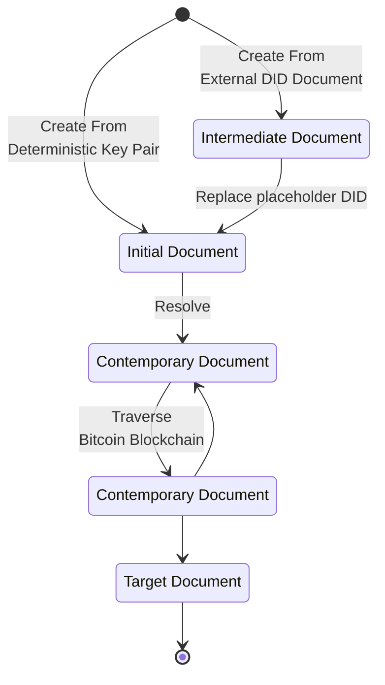

# Conformance

Let's see if I can add code and diagrams:

Rust code:

```rust
#[derive(Debug, Clone, PartialEq, Eq)]
pub struct Did {
    encoded: String,
    components: DidComponents,
}

impl FromStr for Did {
    type Err = Error;

    fn from_str(did: &str) -> Result<Self, Self::Err> {
        let components = parse_did_identifier(did)?;

        Ok(Self {
            encoded: did.to_string(),
            components,
        })
    }
}
```

JSON:

```json
{
  "@context": [
    "https://w3id.org/security/v2",
    "https://w3id.org/zcap/v1",
    "https://w3id.org/json-ld-patch/v1",
    "https://btcr2.dev/context/v1"
  ],
  "patch": [
    {
      "op": "add",
      "path": "/verificationMethod/1",
      "value": {
        "id": "did:btcr2:x1qhjw6jnhwcyu5wau4x0cpwvz74c3g82c3uaehqpaf7lzfgmnwsd7spmmf54#key-1",
        "type": "Multikey",
        "controller": "did:btcr2:x1qhjw6jnhwcyu5wau4x0cpwvz74c3g82c3uaehqpaf7lzfgmnwsd7spmmf54",
        "publicKeyMultibase": "zQ3shSnvxNK94Kpux1sp8RCWfn4dTFcAr1fZLf7E3Dy19mEBi"
      }
    },
    {
      "op": "add",
      "path": "/authentication",
      "value": [
        "did:btcr2:x1qhjw6jnhwcyu5wau4x0cpwvz74c3g82c3uaehqpaf7lzfgmnwsd7spmmf54#key-1"
      ]
    }
  ],
  "sourceHash": "8beuAJ8w88YWrms8hsqCnZn2atxBMGsQ7YBFhzPx5b2q",
  ...
}
```

Mermaid:



This is a reference to a source {{#cite BIP350}}.


Table:

| Network          | Value |
|:-----------------|:------|
| bitcoin          | 0     |
| signet           | 1     |
| regtest          | 2     |
| testnet3         | 3     |
| testnet4         | 4     |
| mutinynet        | 5     |
| reserved         | 6-B   |
| custom network 1 | C     |
| custom network 2 | D     |
| custom network 3 | E     |
| custom network 4 | F     |


<div class="aside">
<h2>My heading</h2>
<p>Some text, some text, some more text.</p>
</div>

